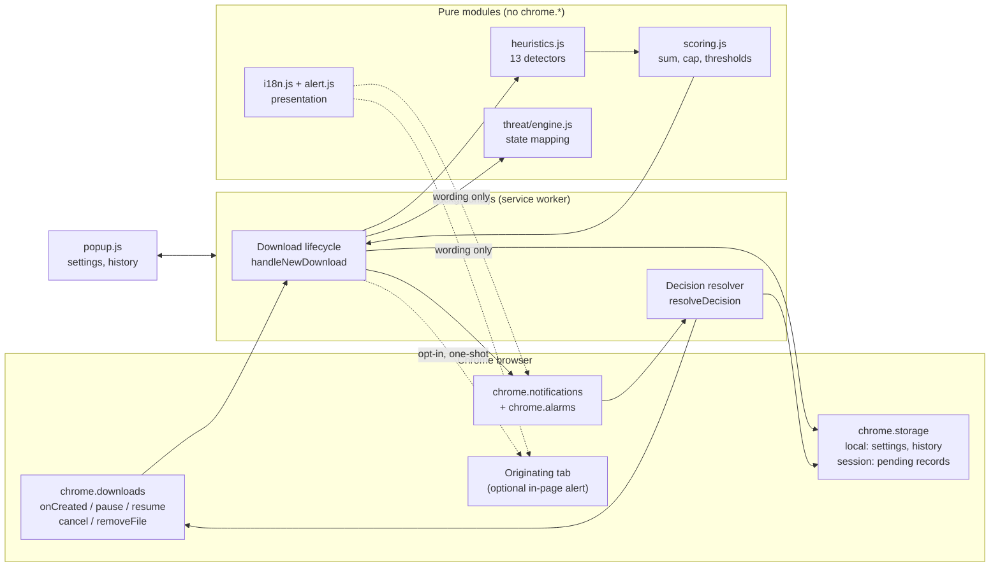
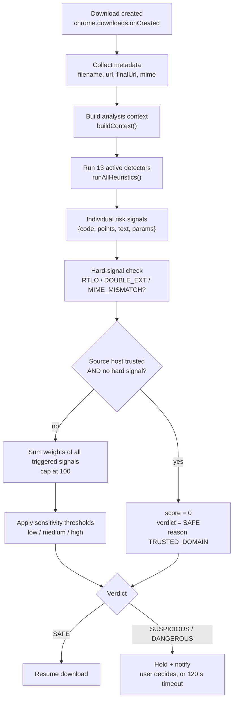
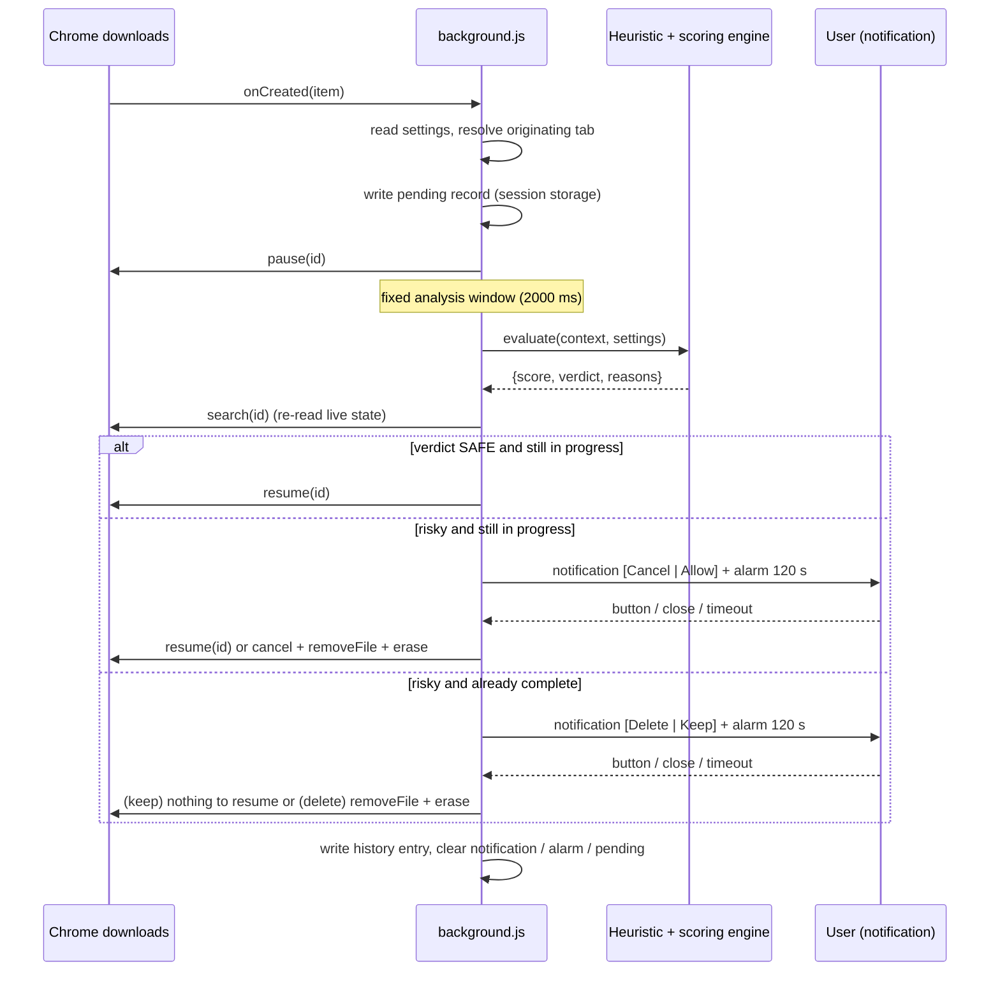

# Cyber Guard: Download Security Assistant

## A Metadata-Based Heuristic Download Risk Detector for Chromium Browsers

**Final Academic / Capstone Project Report**

| | |
|---|---|
| **Project** | Cyber Guard: Download Security Assistant |
| **Artifact** | Chrome Manifest V3 extension, version 0.2.0 (`manifest.json`) |
| **Repository baseline** | Branch `feature-backend`, commit `cee3a78` ("Finalize Cyber Guard academic capstone release") |
| **Project nature** | Academic cybersecurity project. Not published to any extension store. |
| **Analysis model** | Local, deterministic, metadata-based heuristic risk scoring |

> **Reading guide for the defense.** The most important sections are §8 (how a malicious
> download is recognized), §9 (the thirteen indicators), §10 (the scoring formula), §11
> (sensitivity thresholds) and §12 (worked examples). Every weight, threshold and
> behavior quoted in this report was read from the source files of the repository, and
> every worked example was computed by running the project's own `evaluate()` function.
> Where something is *not* implemented, or could not be verified, this report says so.

---

## Table of Contents

1. [Abstract](#1-abstract)
2. [Introduction](#2-introduction)
3. [Problem Statement and Objectives](#3-problem-statement-and-objectives)
4. [System Overview](#4-system-overview)
5. [System Architecture](#5-system-architecture)
6. [Scope Statement: What "Detection" Means in Cyber Guard](#6-scope-statement-what-detection-means-in-cyber-guard)
7. [Heuristic Detection vs. Signature and Content Scanning](#7-heuristic-detection-vs-signature-and-content-scanning)
8. [Detailed Explanation of How Risky Downloads Are Detected](#8-detailed-explanation-of-how-risky-downloads-are-detected)
9. [Heuristic Indicators and Their Weights](#9-heuristic-indicators-and-their-weights)
10. [Risk Scoring Algorithm](#10-risk-scoring-algorithm)
11. [Sensitivity Levels and Classification](#11-sensitivity-levels-and-classification)
12. [Worked Examples](#12-worked-examples)
13. [False Positives and False Negatives](#13-false-positives-and-false-negatives)
14. [Download Protection Workflow](#14-download-protection-workflow)
15. [Completed-Download Race Handling](#15-completed-download-race-handling)
16. [In-Page Security Alerts](#16-in-page-security-alerts)
17. [Originating-Tab Security](#17-originating-tab-security)
18. [Threat Engine and Provider Abstraction](#18-threat-engine-and-provider-abstraction)
19. [Privacy and Security Architecture](#19-privacy-and-security-architecture)
20. [Localization and Accessibility](#20-localization-and-accessibility)
21. [Threat Model](#21-threat-model)
22. [Testing Methodology](#22-testing-methodology)
23. [Evaluation and Results](#23-evaluation-and-results)
24. [Limitations and Out-of-Scope Threats](#24-limitations-and-out-of-scope-threats)
25. [Future Work](#25-future-work)
26. [Conclusion](#26-conclusion)
- [Appendix A: Source-to-Section Traceability](#appendix-a-source-to-section-traceability)
- [Appendix B: Reproducing the Worked Examples](#appendix-b-reproducing-the-worked-examples)

---

## 1. Abstract

Downloaded files are a primary route by which malware reaches end users, and the
decisive moment is often a human one: the user decides whether to open a file based on
how its name, origin and type *look*. Attackers exploit this by disguising executables as
documents, spoofing extensions, abusing Unicode and serving payloads from throw-away hosts.

Cyber Guard is a Chrome extension that intervenes at that moment. When a download
starts, it attempts to pause it, evaluates the download's **metadata** (file name, source
URL, host characteristics and MIME type) against thirteen heuristic indicators, combines
the triggered indicators into a weighted **risk score** between 0 and 100, and classifies
the download as **Safe**, **Suspicious** or **Dangerous** according to a user-selectable
sensitivity level. Safe downloads resume automatically. Risky downloads are held and the
user is asked, through a persistent notification (and optionally an in-page alert), to
cancel or allow them. If the file finished before it could be held, Cyber Guard offers to
delete it.

The detection mechanism is a **metadata-based heuristic threat detection algorithm**. It
does not determine whether a file contains malware by analyzing its binary contents.
Instead, it identifies observable indicators associated with potentially malicious
downloads and combines them into a risk score. Cyber Guard is therefore a *risk-flagging
and decision-support tool*, not an antivirus.

All analysis runs locally inside the browser. The system has no backend, makes no network
requests for analysis, uploads no files, and contains no analytics or account system. The
interface is available in English, Arabic (right-to-left), Spanish and French, and
localization is architecturally separated from the security logic. The implementation is
verified by an automated suite of 285 tests, all of which pass.

**Keywords:** download security, heuristic detection, risk scoring, browser extension,
Chrome Manifest V3, extension spoofing, Unicode right-to-left override, privacy-preserving
security.

---

## 2. Introduction

Web browsers are the main interface through which people obtain software and documents.
A malicious download rarely announces itself. Social-engineering attacks rely on the
victim misjudging a file: a "PDF invoice" that is really an executable, an archive from an
unfamiliar domain, a script presented as a document.

Traditional endpoint protection addresses this by inspecting file content (signatures,
emulation, behavior) *after* the file reaches disk. That is powerful but it happens late,
it is opaque to the user, and it is unavailable in many environments (shared or
unmanaged machines, students, lightly protected devices). A complementary layer is to
examine the **context of the download** at the browser, *before* the user has had a chance
to open it, and to surface a clear, explainable warning.

Cyber Guard implements that complementary layer. It is deliberately scoped as a
metadata-driven early-warning system whose decisions are fully explainable: every verdict
comes with the list of indicators that produced it.

---

## 3. Problem Statement and Objectives

### 3.1 Problem statement

Users routinely download files whose true nature differs from what their presentation
suggests. The browser's default behavior provides little friction or explanation at the
decision point. The problem addressed is:

> *How can a browser extension, using only information available locally about a
> download, identify downloads that exhibit patterns commonly associated with deception or
> malicious delivery, pause the download long enough to evaluate it, and put an
> explainable decision in front of the user, without sending any user data off the
> device?*

### 3.2 Why the problem matters

- **Extension and filename deception is cheap and effective.** Techniques such as
  `invoice.pdf.exe` or Unicode bidirectional overrides require no exploit; they exploit
  human perception.
- **The decision point is brief.** Once a user opens a file, protection depends on
  other layers. A warning before that moment is the cheapest intervention.
- **Privacy constraints.** Many reputation-based approaches send URLs or hashes to third
  parties. A purely local approach avoids that exposure.

### 3.3 Project objectives

| # | Objective | Where addressed |
|---|---|---|
| O1 | Detect download-metadata patterns associated with deceptive or malicious delivery | §8, §9 |
| O2 | Produce an explainable, bounded risk score and a three-level verdict | §10, §11 |
| O3 | Intervene before the file is opened: pause, evaluate, then resume or hold | §14 |
| O4 | Handle the case where a download finishes before it can be held | §15 |
| O5 | Warn the user on the originating page without compromising page isolation | §16, §17 |
| O6 | Keep all analysis local, with no backend and no data egress | §19 |
| O7 | Support four languages including right-to-left Arabic without touching security logic | §20 |
| O8 | Verify behavior with a reproducible automated test suite | §22, §23 |
| O9 | State honestly what the system cannot do | §6, §13, §24 |

---

## 4. System Overview

Cyber Guard runs as a Chrome Manifest V3 service worker (`background.js`) with a popup
user interface. When Chrome reports a new download (`chrome.downloads.onCreated`), the
service worker:

1. checks that protection is enabled;
2. records a *pending* entry in session storage;
3. attempts to **pause** the download;
4. waits a fixed analysis window (2,000 ms in the current code, see §14.3) and runs the
   pure-function heuristic engine on the download's metadata;
5. re-reads the live state of the download;
6. **resumes** it if the verdict is Safe, or **holds** it and notifies the user if the
   verdict is Suspicious or Dangerous;
7. acts on the user's decision (Cancel/Allow for a held download; Delete/Keep for a
   completed one), or on a 120-second timeout, and records the outcome in a local history.

The popup lets the user choose a sensitivity level (Low, Medium, High), enable or disable
protection, choose a language, opt in to in-page alerts, and review recent decisions.

---

## 5. System Architecture

### 5.1 Module structure

```
manifest.json            MV3 manifest: 4 required permissions, 1 optional permission
                         (+ optional http/https host access)
background.js            Service worker: settings, download lifecycle, decisions,
                         notifications, alarms, recovery, message API
popup.html / .css / .js  Popup UI (RTL-capable)

lib/heuristics.js        Pure detectors -> { code, points, text, params }
lib/scoring.js           Score, sensitivity thresholds, trusted-domain logic, verdict
lib/alert.js             Notification text builders (presentation only)
lib/i18n.js              Localization resolver over _locales catalogues
lib/page-alert.js        In-page alert: gating, payload, injected renderer
lib/threat/provider.js   Threat-provider contract (null + local providers only)
lib/threat/engine.js     Threat-state mapping; a provider can never change a verdict
lib/history.js           Persistent local decision history (max 100 entries)
lib/popup-core.js        DOM-free popup view models and messaging
lib/radar-ui.js          Decorative popup radar (presentation only)
_locales/{en,ar,es,fr}/messages.json    75 message keys per language
lib/*.test.js            node:test suites (285 tests)
```

A deliberate design rule is that the security-relevant modules (`heuristics.js`,
`scoring.js`, `alert.js`, `i18n.js`, `page-alert.js`, `popup-core.js`, `radar-ui.js`,
`threat/*.js`) contain no `chrome.*` calls at module scope. They are pure and run
unchanged under Node's test runner, which is what makes the detection logic directly
unit-testable. Only `background.js`, `popup.js` and `history.js` touch Chrome APIs.

### 5.2 Component diagram



The dotted `i18n` edges are the architectural statement that localization only supplies
*wording*; it never feeds back into scoring.

---

## 6. Scope Statement: What "Detection" Means in Cyber Guard

This section is the foundation for everything that follows, so it is stated precisely.

> **The proposed detection mechanism is a metadata-based heuristic threat detection
> algorithm. It does not determine whether a file contains malware by analyzing its binary
> contents. Instead, it identifies observable indicators associated with potentially
> malicious downloads and combines them into a risk score.**

Concretely:

- Cyber Guard **does not open, read, hash or scan the bytes of any file**.
- It **does not match virus signatures** and has no signature database.
- It **does not execute or emulate** files, and does not monitor runtime behavior.
- It **does not query any reputation service**, local or remote.
- It **does** examine *metadata*: the file name, the download URL, the host derived from
  that URL, the URL scheme and the MIME type reported for the download.
- It **does** recognize *patterns commonly associated with* suspicious or malicious
  downloads, assigns each pattern a weight, and classifies the result.

Consequently the following statements are **not** claims made by this project, and should
not be attributed to it:

| Claim not made | Reason |
|---|---|
| "The algorithm detects every virus." | It never inspects file contents; it flags patterns. |
| "The extension guarantees a file is malware-free." | A *Safe* verdict means "no indicators fired", nothing more. |
| "Cyber Guard replaces antivirus software." | It operates on a different evidence class and a different layer. |
| "Cyber Guard performs binary malware scanning." | No file content is read at any point. |

The correct reading of each verdict is: **Safe** = none or few of the known risk patterns
were observed; **Suspicious** = a meaningful combination of risk patterns was observed;
**Dangerous** = a strong combination of risk patterns was observed. None of these is a
statement about the file's actual contents.

---

## 7. Heuristic Detection vs. Signature and Content Scanning

The two approaches differ in *what evidence they use*, and therefore in what they can and
cannot conclude.

```
Cyber Guard (this project)                 Traditional antivirus / content scanning
--------------------------                 ----------------------------------------
Download metadata                          File bytes (and often runtime behavior)
   (name, URL, host, MIME)                      |
        |                                       v
        v                                  Signature / hash match, static analysis,
Heuristic indicators                       emulation, behavioral monitoring,
   (13 pattern checks)                     cloud reputation lookup
        |                                       |
        v                                       v
Weighted risk score (0-100)                Malware family / clean determination
        |                                       |
        v                                       v
Safe / Suspicious / Dangerous              Block / quarantine / remove
```

| Dimension | Cyber Guard (metadata heuristics) | Conventional antivirus |
|---|---|---|
| Evidence examined | File name, URL, host, MIME type | File contents, signatures, behavior, reputation |
| Can identify a specific malware family | No | Often yes |
| Can detect a malicious file with a normal-looking name and source | No | Frequently yes |
| Can flag a deceptive *presentation* (e.g. `invoice.pdf.exe`) before the file is opened | Yes | Sometimes; not its main mechanism |
| Needs the file to be fully downloaded | No (analysis happens during download) | Typically yes |
| Needs a signature/reputation database or network | No | Usually yes |
| Explainability to the user | High: each verdict lists its indicators | Often a single threat name |
| Privacy exposure | None: nothing leaves the device | Varies; may upload hashes or files |
| Failure mode | Misses content-only maliciousness; flags legitimate-but-unusual downloads | Misses novel malware; occasional false positives |

The comparison is not a ranking. The two techniques are complementary, and a
metadata-only layer is explicitly not a substitute for content-aware protection. A
project that understands this limitation is better positioned to place its contribution
correctly: **an inexpensive, private, explainable early warning at the point of
download.**

---

## 8. Detailed Explanation of How Risky Downloads Are Detected

### 8.1 What the algorithm observes (and nothing else)

When a download is created, `buildContext()` in `background.js` copies a fixed set of
fields from Chrome's `DownloadItem` into an *analysis context*. The context is the only
input the detection engine ever receives.

| Context field | Source | Used by detectors? | Purpose |
|---|---|---|---|
| `filename` | `DownloadItem.filename` | **Yes** | Extension, double-extension, Unicode and spacing checks; MIME check |
| `url` | `DownloadItem.url` | **Yes** | Fallback source URL; fallback file name |
| `finalUrl` | `DownloadItem.finalUrl` | **Yes** (preferred over `url`) | Scheme, host, IP, TLD and Punycode checks |
| `mime` | `DownloadItem.mime` | **Yes** | MIME-mismatch check |
| `redirectChain` | **Hard-coded to `[]`** | Read by one detector, but always empty | See §9.13 and §24 |
| `referrer` | `DownloadItem.referrer` | **No** | Used only to locate the originating tab (§17) |
| `pageUrl` | copy of `referrer` | **No** | Not used by any detector |

The **file contents are never part of the context.** The engine is therefore, by
construction, metadata-based.

From these fields the detectors derive the following *features*:

| Derived feature | How it is computed (`lib/heuristics.js`) |
|---|---|
| Resolved file name | Last path segment of `filename` (splitting on `\` and `/`). If empty, the decoded last path segment of `finalUrl`, then of `url`. |
| Extension list | File name split on `.`, first segment dropped, empty entries removed, each entry lower-cased and trimmed. |
| Last extension | Final element of the extension list. |
| Penultimate extension | Second-to-last element, used by the double-extension check. |
| Source URL | `finalUrl` if it is a non-empty string, otherwise `url`. |
| Host | `new URL(sourceUrl).hostname`, lower-cased. Invalid URLs yield an empty host. |
| URL scheme | `new URL(sourceUrl).protocol`. |
| IP-literal flag | Host is a strict dotted IPv4 quad (each octet 0-255, no leading zeros), or, after removing brackets, contains `:` (IPv6). |
| Top-level label | Last dot-separated label of the host. |
| Punycode label | First host label that begins with `xn--`. |
| Normalized MIME | Lower-cased MIME with any `;parameters` removed. |

Because the host is obtained from the WHATWG URL parser, unusual IPv4 spellings are
normalized before the IP check. For example, `http://3232235777/` and
`http://0xC0.0xA8.1.1/` both resolve to host `192.168.1.1` and trigger the IP-host
indicator (confirmed by running the project's code).

### 8.2 The detection pipeline

```
Download Created
      |
Collect Download Metadata
      |
Build Analysis Context
      |
Run Heuristic Detectors
      |
Generate Individual Risk Signals
      |
Assign Weighted Scores
      |
Apply Hard-Signal Rules
      |
Cap Score at 100
      |
Apply Sensitivity Thresholds
      |
SAFE / SUSPICIOUS / DANGEROUS
      |
Resume / Hold / Alert / User Decision
```



**Stage 1: Download created.** Chrome fires `chrome.downloads.onCreated`. The handler
reads the user's settings; if protection is disabled it leaves the download untouched.

**Stage 2: Collect download metadata.** The handler has the Chrome `DownloadItem`. No
network request is made to obtain anything further; only what Chrome already reports is
used.

**Stage 3: Build the analysis context.** `buildContext()` copies the string fields
described in §8.1, replacing anything that is not a string with `""`. This normalization
means the engine never sees `undefined` or non-string values.

**Stage 4: Run the heuristic detectors.** `runAllHeuristics()` evaluates fourteen checks
in a fixed order: thirteen active detectors and one stub (§9.14). Each check is wrapped
in its own `try/catch`, so a failure inside a single detector can never interrupt
download handling or suppress the other detectors. Detectors are *independent*: none reads
another's output.

**Stage 5: Generate individual risk signals.** A detector that finds its pattern returns a
*reason object* `{ code, points, text, params }`; one that does not returns `null`.
`code` is a stable identifier, `points` is the weight, `text` is an English sentence
(fallback only), and `params` holds language-independent values (file name, extension,
host, ...) used later to render a localized sentence.

**Stage 6: Assign weighted scores.** Weights are fixed constants in
`HEURISTIC_CONSTANTS.points` (§9). They are not learned and do not depend on context
beyond whether the detector fired. (The one structural exception is the redirect-chain
detector, which has two weights depending on hop count.)

**Stage 7: Apply hard-signal rules.** Three signal codes are designated *hard*:
`RTLO_CHARACTER`, `DOUBLE_EXTENSION`, `MIME_MISMATCH`. In the implementation, a hard
signal has exactly one effect: **it disables the trusted-domain exemption** (§10.4). It
does not add extra points, and it does not force a verdict by itself. A hard signal is a
*signal whose presence is considered too deceptive to be excused by the user's trust in
the source host*. (See §10.4 for why this distinction matters.)

**Stage 8: Cap the score at 100.** The total of the triggered weights is clamped to a
maximum of 100 (§10).

**Stage 9: Apply sensitivity thresholds.** The score is compared with two thresholds
chosen by the user's sensitivity level (§11).

**Stage 10: Classify.** The result is `safe`, `suspicious` or `dangerous`.

**Stage 11: Resume / hold / alert / user decision.** `background.js` acts on the verdict:
Safe downloads resume; Suspicious and Dangerous downloads are held with a notification
(and optionally an in-page alert), and the user chooses to cancel or allow (§14). A
verdict that cannot be produced, because of an internal error, fails open to Safe (§24).

### 8.3 Pseudocode

```text
function evaluate(ctx, settings):
    sensitivity    <- settings.sensitivity if in {low, medium, high} else "medium"
    trustedDomains <- settings.trustedDomains if list else []
    sourceHost     <- hostname( ctx.finalUrl if non-empty else ctx.url )

    reasons <- []
    for each detector d in [script, executable, container, macro, doubleExt,
                            rtlo, trailingSpacesDots, mimeMismatch, insecureHttp,
                            ipHost, suspiciousTld, punycode, redirectChain, lookalike]:
        try:    r <- d(ctx)             # returns a reason {code, points, ...} or null
        catch:  r <- null               # one failing detector never stops the others
        if r != null: append r to reasons
    sort reasons by points, descending   # presentation order only

    hasHardSignal <- any r in reasons with r.code in {RTLO_CHARACTER,
                                                      DOUBLE_EXTENSION,
                                                      MIME_MISMATCH}

    if isTrustedHost(sourceHost, trustedDomains) and not hasHardSignal:
        return { score: 0, verdict: "safe", reasons: [TRUSTED_DOMAIN (0 pts)] }

    score <- 0
    for r in reasons:
        if r.points is a finite number and r.points > 0: score <- score + r.points
    score <- min(score, 100)
    score <- truncate_to_integer(score)

    (tSusp, tDang) <- THRESHOLDS[sensitivity]
    if   score >= tDang:  verdict <- "dangerous"
    elif score >= tSusp:  verdict <- "suspicious"
    else:                 verdict <- "safe"

    return { score, verdict, reasons }
```

This is a direct transcription of `evaluate()`, `computeScore()` and `getVerdict()` in
`lib/scoring.js`.

---

## 9. Heuristic Indicators and Their Weights

### 9.1 Summary of all indicators

The repository implements **13 active detectors** (codes below) and **1 stub**. The
`HEURISTIC_CONSTANTS.points` table contains **14 weight constants**, because the
redirect-chain detector has two (a short-chain weight and a long-chain weight).

| # | Code | Weight | Class | Evidence examined | Active in production? |
|--:|---|--:|---|---|---|
| 1 | `RTLO_CHARACTER` | **50** | **Hard** | File name | Yes |
| 2 | `DOUBLE_EXTENSION` | **40** | **Hard** | File name | Yes |
| 3 | `SCRIPT_EXTENSION` | **35** | Weighted | File name | Yes |
| 4 | `MIME_MISMATCH` | **30** | **Hard** | File name + MIME | Yes |
| 5 | `EXECUTABLE_EXTENSION` | **25** | Weighted | File name | Yes |
| 6 | `TRAILING_SPACES_OR_DOTS` | **20** | Weighted | File name | Yes |
| 7 | `IP_HOST` | **20** | Weighted | Source host | Yes |
| 8 | `MACRO_DOCUMENT` | **15** | Weighted | File name | Yes |
| 9 | `PUNYCODE_HOST` | **15** | Weighted | Source host | Yes |
| 10 | `CONTAINER_EXTENSION` | **10** | Weighted | File name | Yes |
| 11 | `INSECURE_HTTP` | **10** | Weighted | URL scheme | Yes |
| 12 | `SUSPICIOUS_TLD` | **10** | Weighted | Source host | Yes |
| 13 | `LONG_REDIRECT_CHAIN` | **10** (3-4 hops) / **20** (5+ hops) | Weighted | Redirect chain | **No**: input is always empty (§9.13) |
| 14 | `LOOKALIKE_DOMAIN` | n/a | n/a | n/a | **Stub**: always returns `null` |

"Hard" means the code is in `SCORING_CONSTANTS.HARD_SIGNAL_CODES`. Since the redirect
detector's production input is always empty, **12 detectors can fire in the shipped
extension**, and 13 fire in unit tests that supply a synthetic chain.

### 9.2 Constant lists used by the detectors

| List | Members | Count |
|---|---|--:|
| Script extensions | `ps1 vbs vbe js jse hta wsf wsh bat cmd lnk reg scr pif msc` | 15 |
| Executable extensions | `exe msi dll jar com cpl msp appx msix` | 9 |
| Container extensions | `iso img vhd vhdx zip rar 7z cab` | 8 |
| Macro-document extensions | `docm xlsm pptm dotm xlam` | 5 |
| Document/media extensions | `pdf doc docx xls xlsx ppt txt jpg jpeg png gif mp3 mp4 zip` | 14 |
| Executable MIME types | `application/x-msdownload`, `application/x-dosexec`, `application/vnd.microsoft.portable-executable`, `application/x-msdos-program`, `application/java-archive` | 5 |
| Suspicious TLDs | `zip mov xyz top click work rest country gq tk ml cf ga` | 13 |
| Bidirectional control characters | U+202A to U+202E and U+2066 to U+2069 | 9 code points |

Each indicator is described below in the same format: what it checks, **why the pattern
is a risk indicator**, weight and class, an example, and a plausible false positive.
The security reasoning is general background about attacker techniques; the *weights*
are design choices of this project and are discussed as such in §9.15.

### 9.3 `RTLO_CHARACTER`: bidirectional control character (weight 50, hard)

**What it checks.** Whether the resolved file name contains any character in
U+202A to U+202E (left-to-right embedding, right-to-left embedding, pop directional
formatting, left-to-right override, right-to-left override) or U+2066 to U+2069
(left-to-right, right-to-left and first-strong isolates, pop directional isolate). Despite
the name, the pattern covers all nine bidirectional formatting controls, not only the
right-to-left override (U+202E).

**Why it is suspicious.** Unicode text is stored in logical order but displayed according
to the bidirectional algorithm. A right-to-left override character instructs the renderer
to display the text that follows it *reversed*. An attacker can therefore save a file whose
real name ends in `.exe` but whose *displayed* name appears to end in a harmless
extension. For example, the stored name `invoice<U+202E>fdp.exe` is rendered as
`invoiceexe.pdf`. The operating system still treats the real final extension (`.exe`) as
authoritative, so the user sees a "PDF" while the system sees an executable. Legitimate
files essentially never need explicit directional *overrides* in their names, which makes
the pattern a strong deception indicator and justifies the highest weight in the table.

**Example.** `invoice<U+202E>fdp.exe` triggers `RTLO_CHARACTER` (+50) and
`EXECUTABLE_EXTENSION` (+25).

**Possible false positive.** Mixed Arabic/Hebrew and Latin file names created by some
software may contain *embedding* or *isolate* controls that are not malicious. Because the
detector is deliberately broad (all nine controls), such names would be flagged. The
plain direction *marks* U+200E and U+200F are **not** in the pattern.

### 9.4 `DOUBLE_EXTENSION`: document extension followed by a program extension (weight 40, hard)

**What it checks.** The extension list has at least two entries, the **penultimate**
extension is one of the 14 document/media extensions, **and** the **final** extension is a
script extension or an executable extension.

**Why it is suspicious.** Many operating-system shells hide known extensions by default.
A file named `document.pdf.exe` is then displayed as `document.pdf`, while its real type,
determined by the *last* extension, is an executable. The
pattern exists only to make an executable *look like* a document, and benign software
has no reason to name files this way, hence the high weight and hard classification.
Note the precise condition: `archive.tar.gz` or `setup.v2.exe` do **not** trigger it,
because the penultimate extension must be a document/media type and the last must be
executable or script.

**Example.** `invoice.pdf.exe` triggers `DOUBLE_EXTENSION` (+40) and
`EXECUTABLE_EXTENSION` (+25), a combined 65.

**Possible false positive.** An administrator's script such as `backup.txt.cmd` follows the
same naming shape. It is rare but legitimate.

### 9.5 `SCRIPT_EXTENSION`: script-type file (weight 35, weighted)

**What it checks.** The final extension is one of 15 script or script-like types:
PowerShell (`ps1`), VBScript (`vbs`, `vbe`), JavaScript (`js`, `jse`), HTML Applications
(`hta`), Windows Script Host (`wsf`, `wsh`), batch files (`bat`, `cmd`), shortcut files
(`lnk`), registry files (`reg`), screensavers (`scr`), program information files
(`pif`) and Management Console snap-ins (`msc`).

**Why it is suspicious.** These file types are executed directly by Windows scripting
hosts, the command interpreter or the shell, without needing a compiled binary. They are
easy to author, trivially obfuscated, and widely used as the first stage of attacks that
download further payloads. Two members deserve a note: `.scr` is in fact a Portable
Executable renamed as a screensaver, and `.lnk` shortcuts can embed arbitrary command
lines. Scripts rank above plain executables (35 vs. 25) in this project's weighting
because they are text, easy to disguise, and routinely delivered by phishing.

**Example.** `update.ps1` triggers `SCRIPT_EXTENSION` (+35).

**Possible false positive.** `.js` is in the set, so an ordinary JavaScript library or
developer download is scored 35, which is already *Suspicious* at Medium sensitivity
(threshold 30). This is a known calibration weakness (§9.15, §13).

### 9.6 `MIME_MISMATCH`: document-looking name, executable content type (weight 30, hard)

**What it checks.** The final extension is one of the 14 document/media extensions, **and**
the normalized MIME type is one of five executable-related types (Windows PE
`x-msdownload`, `x-dosexec`, `vnd.microsoft.portable-executable`, DOS program, Java archive).

**Why it is suspicious.** The file *name* is chosen by whoever publishes the download; the
*MIME type* is a separate declaration made by the serving side about the content. When the
two disagree in this specific direction (name says "PDF/image/document", content type says
"Windows executable"), either the server is misconfigured or the file has been renamed to
hide what it is. The second case is a standard disguise technique. Because it is a
*contradiction between two independent descriptions of the same download*, it is treated as
a hard signal.

**Example.** `photo.jpg` served as `application/x-msdownload` triggers `MIME_MISMATCH` (+30).
MIME parameters are stripped and case is ignored, so `Application/X-MSDownload; charset=binary`
matches.

**Possible false positive.** A misconfigured server or a download proxy that labels
arbitrary files with a generic executable type. A `.zip` file served as
`application/java-archive` would also trigger it, since `zip` is in the document/media set.

**Limits.** The check is one-directional: it does not flag an executable-looking name with a
document MIME, and it only knows five MIME types. Servers commonly send
`application/octet-stream`, which is not in the list and is therefore never a mismatch.

### 9.7 `EXECUTABLE_EXTENSION`: native program or installer (weight 25, weighted)

**What it checks.** The final extension is one of `exe`, `msi`, `dll`, `jar`, `com`, `cpl`,
`msp`, `appx`, `msix`.

**Why it is suspicious.** These are formats that the operating system or the Java runtime
will run as code, with the user's privileges. A file of this kind is the end-point of most
malware delivery chains. The weight is intentionally *moderate*, not high: executables are
also how nearly all legitimate software is installed, so the extension alone is evidence
that warrants attention, not a conviction.

**Example.** `setup.exe` triggers `EXECUTABLE_EXTENSION` (+25).

**Possible false positive.** Every legitimate installer. This is the single largest
source of false positives in the design and is why the weight alone (25) stays below the
Suspicious threshold at Low and Medium sensitivity.

### 9.8 `TRAILING_SPACES_OR_DOTS`: misleading spacing before the extension (weight 20, weighted)

**What it checks.** Any one of three patterns in the file name: (a) whitespace immediately
before the final `.extension` (e.g. `name .exe`); (b) two or more consecutive dots before
the final extension segment (e.g. `name...exe`); (c) five or more consecutive spaces or
tabs anywhere in the name.

**Why it is suspicious.** Padding a name with spaces pushes the real extension off the
visible edge of truncated file lists and dialogs, so only the harmless-looking beginning
of the name is seen. Stray dots and trailing spaces are also commonly normalized away by
Windows path handling, creating a gap between the name a user sees and the one the system
resolves. These are cosmetic manipulations with no purpose in an honest file name.

**Example.** `invoice.pdf .exe` triggers `TRAILING_SPACES_OR_DOTS` (+20) along with
`DOUBLE_EXTENSION` (+40) and `EXECUTABLE_EXTENSION` (+25), a total of 85.

**Possible false positive.** Carelessly named personal files such as `My notes .txt`.

### 9.9 `IP_HOST`: download served from a raw IP address (weight 20, weighted)

**What it checks.** The source host is an IPv4 literal (four octets, 0-255) or an IPv6
literal (contains `:` after removing brackets). `localhost` is not an IP literal and is
not flagged.

**Why it is suspicious.** Legitimate publishers distribute software from named domains,
usually with a TLS certificate bound to the name. A raw IP address means there is no
domain identity to check against reputation lists or certificates, and attackers use bare
IPs for disposable staging servers that are cheap to stand up and discard. In combination
with an executable download the pattern becomes noticeably more meaningful: the weight (20)
is modest by itself and contributes mostly by *adding up* with other signals.

**Example.** `http://192.0.2.10/setup.exe` triggers `IP_HOST` (+20).

**Possible false positive.** Internal file servers, NAS devices, router firmware pages and
local development servers. The project's own end-to-end test traffic uses `127.0.0.1`.

### 9.10 `MACRO_DOCUMENT`: macro-enabled Office file (weight 15, weighted)

**What it checks.** The final extension is one of `docm`, `xlsm`, `pptm`, `dotm`, `xlam`.

**Why it is suspicious.** These Office formats can embed Visual Basic for Applications
macros, which execute code when the document is opened and macros are enabled. Malicious
macro documents have long been a staple delivery mechanism, typically with a lure that
encourages the user to "enable content". The weight is low because a macro-enabled file
is not itself an executable and has many legitimate business uses.

**Example.** `budget.xlsm` triggers `MACRO_DOCUMENT` (+15).

**Possible false positive.** Corporate templates and spreadsheets that legitimately use
macros. *Note:* legacy `.doc`/`.xls` files can also contain macros but are not in this
list; see §24.

### 9.11 `PUNYCODE_HOST`: internationalized-domain label (weight 15, weighted)

**What it checks.** Any dot-separated label of the source host starts with `xn--`.

**Why it is relevant.** Punycode is the ASCII encoding of internationalized domain names.
Because many Unicode characters look identical to Latin ones (a Cyrillic "а" resembles a
Latin "a"), an attacker can register a domain that *renders* like a well-known brand but is
a different domain. This is the homograph attack, and `xn--` is its visible fingerprint
at the DNS level. The detector does **not** decode the label or compare it with known
brands (that would be the lookalike detector, which is a stub, §9.14); it only notes that
the host uses an internationalized label, a necessary condition for a homograph.

**Example.** `https://xn--pple-43d.example.com/archive.zip` triggers `PUNYCODE_HOST` (+15).

**Possible false positive.** Genuine internationalized domains, including legitimate
Arabic, Cyrillic or Chinese sites. This matters for an Arabic-language user base and is the
reason the weight is modest.

### 9.12 `CONTAINER_EXTENSION`, `INSECURE_HTTP`, `SUSPICIOUS_TLD` (weight 10 each, weighted)

**`CONTAINER_EXTENSION`** (`iso img vhd vhdx zip rar 7z cab`). *Why:* a container
conceals what is inside. Metadata analysis cannot see the files within an archive or disk
image, so the container is treated as a low-weight "unknown contents" flag. Disk-image
formats (`iso`, `img`, `vhd`, `vhdx`) have in addition been used in attacks to package
payloads in a way that some file-origin protections did not follow. *Example:*
`archive.zip` (+10). *False positive:* nearly all software and source-code distribution
uses archives, which is why the weight is the lowest in the table.

**`INSECURE_HTTP`** (scheme is `http:`). *Why:* a plain-HTTP download has neither
encryption nor server authentication, so an on-path attacker can modify the file in
transit, and the user cannot confirm the server's identity. This reduces transport
security, but it does not by itself indicate malicious content, hence the low weight.
*Example:* `http://example.org/tool.zip` (+10). *False positive:* legitimate legacy
mirrors and local-network servers.

**`SUSPICIOUS_TLD`** (last host label in `zip mov xyz top click work rest country gq tk
ml cf ga`). *Why:* certain top-level domains are inexpensive or free to register, which
makes them attractive for disposable infrastructure, and security vendors commonly report
some of them as over-represented in abuse. `.zip` and `.mov` are additionally confusable
with file extensions, because a name like `report.zip` can be a hostname. This project did
not measure abuse rates itself; the list is a curated heuristic. *Example:*
`https://files.example.top/a.txt` (+10). *False positive:* any legitimate site on `.xyz`,
`.work` and similar domains.

### 9.13 `LONG_REDIRECT_CHAIN`: many redirects (weight 10 or 20; inactive in production)

**What it checks.** The number of entries in `ctx.redirectChain`: 5 or more hops scores
20, 3 or 4 hops scores 10, fewer scores nothing.

**Why it would be relevant.** Redirect chains are used to launder an origin, hide the true
destination from simple URL checks and bounce through tracking or cloaking services.

**Status.** In the shipped extension `buildContext()` hard-codes `redirectChain: []`, so
this detector **never fires in production**. It is exercised only by unit tests that
inject a synthetic chain. The source marks redirect tracking as an outstanding item
(`TODO(step 3)`). The project's earlier documentation attributes the gap to the downloads
API not exposing redirect history; the source code itself records only that the chain is
not populated, so this report states the verified fact (always empty) and treats the stated
cause as not independently verified. `finalUrl`, when Chrome supplies it, *is* used for
host checks, so the host heuristics evaluate the post-redirect location whenever it is
available.

### 9.14 `LOOKALIKE_DOMAIN`: not implemented

`checkLookalikeDomain()` is a stub that always returns `null`, marked
`TODO(step 9)`. It contributes no points. The typosquatting/lookalike threat is therefore
addressed only indirectly, via the Punycode indicator, and not at all for ASCII lookalikes
such as `paypa1.com` (confirmed: the stub returns `null`). This is stated as a limitation
(§24) and as future work (§25).

### 9.15 On the choice of weights

The weights are **expert-assigned design constants**, not statistically fitted. They follow
a simple ordering principle: indicators that exist to *deceive* (RTLO, double extension,
MIME contradiction) outrank indicators that describe *what the file is* (script,
executable), which outrank indicators that describe *where it came from or how it is
packaged* (IP host, Punycode, HTTP, TLD, container). The principle is defensible, but the
numeric values have not been calibrated against a labeled dataset; doing so is future work
(§25). With the thresholds in §11, no single indicator reaches *Dangerous* at Medium
sensitivity (the largest single weight is 50, against a Dangerous threshold of 60), so a
Dangerous verdict at Medium always requires a combination of indicators.

---

## 10. Risk Scoring Algorithm

### 10.1 Formula

Let *R* be the set of triggered reasons for a download, each with a weight *w<sub>i</sub>*.
Only finite, strictly positive weights contribute. The implementation (`computeScore`) is

```
raw   = SUM over triggered reasons i of  w_i          (w_i finite and > 0)
score = TRUNC( MIN(raw, 100) )                        (integer in [0, 100])
```

or, in the usual notation,

```
Score = clamp( sum of triggered heuristic weights, 0, 100 )
```

Verified against the source: the initial value is 0; each triggered detector adds its
weight once (a detector can fire at most once per download, so there is no double
counting); the sum is capped at 100; the result is truncated to an integer (all weights are
integers, so truncation changes nothing in practice); a non-array input, or non-finite or
non-positive weights, contribute 0.

### 10.2 Why a weighted sum

A weighted additive model is simple, transparent and *explainable*: the verdict can be
justified by listing the fired indicators and their points. It also captures a key
security intuition: **combinations of weak indicators can produce a strong overall risk
score.** For instance, no single one of `EXECUTABLE_EXTENSION` (25), `IP_HOST` (20) or
`INSECURE_HTTP` (10) is alarming on its own, yet together they total 55: *Suspicious* at
Low and Medium, *Dangerous* at High. The additive model lets the engine express "this
download is not individually damning on any axis, but is unusual on all of them."

### 10.3 Capping

The cap at 100 keeps the score on a fixed, human-readable scale and prevents unbounded
growth when many indicators fire together. A download with `RTLO_CHARACTER` (50),
`DOUBLE_EXTENSION` (40), `EXECUTABLE_EXTENSION` (25), `IP_HOST` (20) and `INSECURE_HTTP`
(10) has a raw total of 145, reported as **100**. Because the maximum thresholds are 70
(Dangerous at Low sensitivity), the cap never changes a verdict; it only normalizes the
display value.

### 10.4 Hard signals and the trusted-domain exemption

The user's settings may contain a list of trusted domains (`trustedDomains`). The exemption
logic in `evaluate()` is:

```
trusted = isTrustedHost(sourceHost, trustedDomains)
if trusted AND NOT hasHardSignal:  -> score 0, verdict "safe",
                                      single informational reason TRUSTED_DOMAIN (0 points)
else:                              -> score normally (all triggered indicators count)
```

Three properties follow directly from the code:

1. **Hard signals are an override of trust, not a score multiplier.** They exist to stop a
   trusted-domain setting from silencing the most deceptive patterns. A trusted site that
   serves `invoice.pdf.exe` is still scored. (Verified by running the engine: a trusted
   `cdn.example.com` serving `invoice.pdf.exe` scores 65, Dangerous at Medium.)
2. **A hard signal does not by itself force a verdict.** `MIME_MISMATCH` alone is worth 30,
   which is only *Suspicious* at Medium and High and *Safe* at Low. `RTLO_CHARACTER` alone
   (50) is *Suspicious* at Low and Medium and *Dangerous* only at High.
3. **When trust is overridden, every triggered indicator counts, not only the hard one.**
   The code scores the full reason list in that branch.

**Host matching.** `isTrustedHost` is case-insensitive and trimmed. A host matches a trusted
domain if it is *equal* to it or *ends with* `"." + domain`. It never uses a plain substring
match, so `evilexample.com` does **not** match a trusted `example.com` (this case is
covered by a dedicated test). `localhost` is never trusted.

**Practical note.** The popup has no interface for editing `trustedDomains`; the setting
exists in storage and is honored by the engine, and is tested, but is not exposed to the
end user in this release (§24).

### 10.5 Other special rules and exemptions

| Rule | Behavior (from source) |
|---|---|
| Unknown or missing sensitivity | Falls back to `medium` |
| Invalid settings object | Treated as `{}`; defaults apply |
| Empty or invalid context | Produces score 0, verdict `safe`, never throws |
| Detector throws | That detector is skipped; others still run |
| Reason ordering | Sorted by weight descending; the notification shows the top three |
| Language | Has no influence on scores, thresholds or verdicts (§20) |

There is no other override: no rule raises a verdict because of the file name alone, and
no rule lowers one except the trusted-domain exemption.

---

## 11. Sensitivity Levels and Classification

### 11.1 Thresholds

The thresholds are defined in `SCORING_CONSTANTS.THRESHOLDS` in `lib/scoring.js`.

| Sensitivity | Suspicious threshold (score >=) | Dangerous threshold (score >=) |
|---|--:|--:|
| **Low** | 40 | 70 |
| **Medium** *(default)* | 30 | 60 |
| **High** | 20 | 50 |

Classification (`getVerdict`) uses inclusive comparisons:

```
verdict = DANGEROUS   if score >= dangerousThreshold(sensitivity)
          SUSPICIOUS  if score >= suspiciousThreshold(sensitivity)   (and below Dangerous)
          SAFE        otherwise
```

An unrecognized or missing sensitivity value resolves to Medium. The thresholds are
constants: they are not affected by the interface language, the history or any runtime
state (verified by tests, §22).

### 11.2 Same score, different verdict

The sensitivity setting does not change *what* is detected or *how many points* each
indicator is worth. It only moves the cut-points. The same raw score can therefore receive
different verdicts depending on the user's setting:

| Raw score | Low (40 / 70) | Medium (30 / 60) | High (20 / 50) |
|--:|---|---|---|
| 10 | Safe | Safe | Safe |
| 25 | Safe | Safe | **Suspicious** |
| 30 | Safe | **Suspicious** | Suspicious |
| 40 | **Suspicious** | Suspicious | Suspicious |
| 50 | Suspicious | Suspicious | **Dangerous** |
| 55 | Suspicious | Suspicious | **Dangerous** |
| 60 | Suspicious | **Dangerous** | Dangerous |
| 65 | Suspicious | Dangerous | Dangerous |
| 70 | **Dangerous** | Dangerous | Dangerous |

(Bold marks the first level at which the verdict changes.) This makes sensitivity an
explicit **operating-point control** on the false-positive / false-negative trade-off
(§13): High catches more borderline downloads and raises more warnings; Low interrupts the
user less and tolerates more risk.

### 11.3 What each verdict triggers

| Verdict | Download in progress | Download already completed |
|---|---|---|
| **Safe** | Resume automatically (green in-page alert, if enabled) | Ignored, nothing to do |
| **Suspicious** | Hold; notification with *Cancel download* / *Allow anyway* | Notification with *Delete file* / *Keep file* |
| **Dangerous** | Hold; notification with *Cancel download* / *Allow anyway*; red state in popup | Notification with *Delete file* / *Keep file* |

The difference between Suspicious and Dangerous therefore lies in the severity wording and
visual state (amber vs. red), and in the fail-safe behavior when the notification cannot be
shown (§14.5). Both are held until the user decides.

---

## 12. Worked Examples

All examples use reserved documentation addresses (`192.0.2.0/24`, `example.com`,
`example.org`) and are **non-malicious, metadata-only test inputs**. No real malware and no
real file is involved: only a file *name*, a *URL* and a *MIME string* are fed to the
engine. Scores were produced by running the repository's own `evaluate()` function (the
script is reproduced in Appendix B). Unless stated, the source is HTTPS.

### Example 1: A likely **SAFE** download

| Field | Value |
|---|---|
| File name | `report.pdf` |
| URL | `https://downloads.example.com/report.pdf` |
| MIME | `application/pdf` |

| Triggered indicator | Points |
|---|--:|
| none | 0 |

```
Raw score = 0        Final score = 0
Low: SAFE     Medium: SAFE     High: SAFE
```

No indicator fires: the extension is neither a script, executable, container nor macro type;
the name is plain; the scheme is HTTPS; the host is a named, non-suspicious domain. The
download resumes automatically.

### Example 2: A **SUSPICIOUS** download

| Field | Value |
|---|---|
| File name | `setup.exe` |
| URL | `http://192.0.2.10/setup.exe` |
| MIME | `application/x-msdownload` |

| Triggered indicator | Points |
|---|--:|
| `EXECUTABLE_EXTENSION` (`.exe`) | +25 |
| `IP_HOST` (`192.0.2.10`) | +20 |
| `INSECURE_HTTP` | +10 |
| **Raw score** | **55** |

```
Raw score = 55       Final score = 55 (below the cap of 100)
Low (40/70):    SUSPICIOUS
Medium (30/60): SUSPICIOUS      <- default
High (20/50):   DANGEROUS
```

Each indicator is individually modest. Their *combination* (an executable, fetched
unencrypted, from a bare IP address) is what moves the download into the held range. At
Medium sensitivity the user receives a Suspicious notification and decides.

### Example 3: A **DANGEROUS** download (double extension)

| Field | Value |
|---|---|
| File name | `invoice.pdf.exe` |
| URL | `https://downloads.example.com/invoice.pdf.exe` |
| MIME | `application/octet-stream` |

| Triggered indicator | Points | Class |
|---|--:|---|
| `DOUBLE_EXTENSION` (`.pdf.exe`) | +40 | Hard |
| `EXECUTABLE_EXTENSION` (`.exe`) | +25 | Weighted |
| **Raw score** | **65** | |

```
Raw score = 65       Final score = 65
Low (40/70):    SUSPICIOUS
Medium (30/60): DANGEROUS       <- default
High (20/50):   DANGEROUS
```

The source is HTTPS from a named domain, so no network-side indicator fires. The verdict is
driven entirely by the file name: a document extension followed by a program extension.
This illustrates that deceptive naming alone is sufficient for *Dangerous* at the default
sensitivity.

### Example 4: The same file name from a worse source (matches the project's lifecycle tests)

| Field | Value |
|---|---|
| File name | `invoice.pdf.exe` |
| URL | `http://127.0.0.1:8000/invoice.pdf.exe` |

| Triggered indicator | Points |
|---|--:|
| `DOUBLE_EXTENSION` | +40 |
| `EXECUTABLE_EXTENSION` | +25 |
| `IP_HOST` (`127.0.0.1`) | +20 |
| `INSECURE_HTTP` | +10 |
| **Raw score** | **95** |

```
Raw score = 95       Final score = 95
Low / Medium / High: DANGEROUS
```

This is exactly the trace emitted by the service worker during the project's automated
lifecycle tests (`heuristic #1 ... DOUBLE_EXTENSION +40`, `... EXECUTABLE_EXTENSION +25`,
`... IP_HOST +20`, `... INSECURE_HTTP +10`, `verdict dangerous score=95`).

### Example 5: Right-to-left override

| Field | Value |
|---|---|
| File name | `invoice<U+202E>fdp.exe` (displayed by many renderers as `invoiceexe.pdf`) |
| URL | `https://cdn.example.com/f` |

| Triggered indicator | Points | Class |
|---|--:|---|
| `RTLO_CHARACTER` | +50 | Hard |
| `EXECUTABLE_EXTENSION` | +25 | Weighted |
| **Raw score** | **75** | |

```
Low / Medium / High: DANGEROUS
```

The user would see a PDF-looking name; the engine sees the true `.exe` extension and the
bidirectional control character.

### Example 6: A hard signal that is only *Suspicious* on its own

| Field | Value |
|---|---|
| File name | `photo.jpg` |
| URL | `https://files.example.xyz/photo.jpg` |
| MIME | `application/x-msdownload` |

| Triggered indicator | Points | Class |
|---|--:|---|
| `MIME_MISMATCH` (`.jpg` vs. executable MIME) | +30 | Hard |
| `SUSPICIOUS_TLD` (`.xyz`) | +10 | Weighted |
| **Raw score** | **40** | |

```
Low (40/70): SUSPICIOUS     Medium: SUSPICIOUS     High: SUSPICIOUS
```

An image that claims to be an executable is held for review, but the evidence is not strong
enough for *Dangerous*. This example shows that "hard" does not mean "automatically
Dangerous" (§10.4).

### Example 7: Trusted domain, with and without a hard signal

Assume the user's trusted list contains `example.com`.

| Download | Result |
|---|---|
| `setup.exe` from `https://cdn.example.com/setup.exe` | No hard signal and trusted host: **score 0, Safe**, single reason `TRUSTED_DOMAIN` (0 points) |
| `invoice.pdf.exe` from `https://cdn.example.com/invoice.pdf.exe` | `DOUBLE_EXTENSION` is a hard signal, so trust is overridden: score 40 + 25 = **65, Dangerous at Medium** |

### Example 8: Capping

`invoice<U+202E>.pdf.exe` from `http://203.0.113.5/...` with MIME `application/x-msdownload`
triggers `RTLO_CHARACTER` 50 + `DOUBLE_EXTENSION` 40 + `EXECUTABLE_EXTENSION` 25 +
`IP_HOST` 20 + `INSECURE_HTTP` 10 = **145 raw**, reported as **100**.

### Example 9: Calibration observations (false-positive behavior)

| Download | Score | Low | Medium | High |
|---|--:|---|---|---|
| `setup.exe` over HTTPS from a named host | 25 | Safe | Safe | Suspicious |
| `lib.js` over HTTPS | 35 | Safe | Suspicious | Suspicious |
| `src.zip` over HTTPS | 10 | Safe | Safe | Safe |
| `budget.xlsm` over HTTPS | 15 | Safe | Safe | Safe |

These expose the design's trade-offs discussed in §13: a legitimate JavaScript file is held
at the default setting, while a legitimate installer passes at Low and Medium.

---

## 13. False Positives and False Negatives

### 13.1 Definitions

- A **false positive** is a legitimate download that is flagged Suspicious or Dangerous.
- A **false negative** is a harmful download that is classified Safe.

### 13.2 Why both are unavoidable in a metadata-only design

The engine reasons only about how a download *presents itself*. The set of legitimate
downloads and the set of harmful downloads **overlap in metadata space**: a legitimate
installer and a malicious installer can have identical names, extensions, schemes and MIME
types, and differ only in their contents, which Cyber Guard never reads. No choice of
weights can separate populations that the evidence does not distinguish. The achievable
goal is therefore not elimination of errors but a defensible, *explicit* operating point,
which is the role of the sensitivity setting.

### 13.3 False positives: examples from this implementation

| Example | Why it is flagged | Level at which it is flagged |
|---|---|---|
| `legitimate-installer.exe` from a vendor's server over plain HTTP at a numeric address (55) | Executable + IP host + HTTP are all genuine, individually benign properties | Suspicious (Low/Medium), Dangerous (High) |
| `legitimate-installer.exe` over HTTPS from a named host (25) | `.exe` alone | Suspicious only at High |
| `lib.js`, an ordinary JavaScript file (35) | `js` is in the script list | Suspicious (Medium/High) |
| A genuine internationalized-domain site (e.g. an Arabic-script domain) serving a ZIP | `xn--` label (+15) plus container (+10) = 25 | Suspicious only at High |
| A mixed Arabic/Latin file name containing a directional embedding/isolate control | Matched by the broad bidirectional pattern (+50) | Suspicious (Low/Medium), Dangerous (High) |

A false positive costs the user a notification and a decision. Because the default action is
user-driven (Allow anyway), the cost of such an error is bounded.

### 13.4 False negatives: examples from this implementation

| Example | Why it is not flagged | Result |
|---|---|---|
| `malware.pdf` served from a normal HTTPS host with MIME `application/pdf` | All metadata looks ordinary; the harm, if any, is inside the file | Score 0, **Safe** |
| A malicious program named `setup.exe` served over HTTPS from a named host | Only `EXECUTABLE_EXTENSION` (25) fires | **Safe** at Low and Medium |
| A malicious legacy `.doc` or `.xls` with an embedded macro | Only macro-*enabled* OOXML extensions (`docm`, `xlsm`, ...) are listed | Score 0, **Safe** |
| A malicious file on a host listed as trusted in the settings and with no hard signal | The trusted-domain exemption returns score 0 | **Safe** |
| A malicious download whose metadata is only revealed after redirects, ASCII lookalike domain | Redirect chain is not populated; lookalike detector is a stub | Not detected |

These are not defects that careful tuning would remove; they are the **inherent limitation of
metadata-based heuristic detection**. A user must not read "Safe" as "clean".

### 13.5 No statistical error rates are claimed

This project did **not** evaluate the engine on a labeled corpus of benign and malicious
downloads. Therefore **no false-positive rate, false-negative rate, precision, recall or
"accuracy" percentage is reported or implied.** The evaluation in §23 is a set of
deterministic test cases demonstrating that the implemented logic behaves as specified.
Measuring real-world error rates requires a properly designed dataset and is listed as
future work (§25).

---

## 14. Download Protection Workflow

### 14.1 End-to-end lifecycle

```
chrome.downloads.onCreated
      |
settings check (protection enabled?)           -- no: leave download untouched
      |
resolve originating tab (early, evidence-based)
      |
state check (still in_progress?)               -- no: skip, "already finished"
      |
create pending record (chrome.storage.session)
      |
attempt pause
      |
collect metadata -> analyze (fixed analysis window, then heuristics + scoring)
      |
re-query the live download state
      |
resolve verdict
      |-- SAFE ------------------------------> resume (optional green page alert)
      |-- SUSPICIOUS / DANGEROUS, in progress -> hold + notify (Cancel / Allow) + 120 s alarm
      |-- SUSPICIOUS / DANGEROUS, completed ---> notify (Delete / Keep) + 120 s alarm
      |
user decision, notification dismissal, or timeout -> resolveDecision -> history + cleanup
```



### 14.2 Step-by-step description

1. **Entry and settings.** `handleNewDownload` loads settings (stored values merged over
   defaults; retired backend keys stripped). If `enabled` is false the download is not
   touched.
2. **Early tab resolution.** The originating tab is resolved *before* any delay, while the
   user's attention is still on the page that started the download (§17).
3. **Skip if already finished.** If the download is not `in_progress` when first seen it is
   logged and skipped; it is not analyzed.
4. **Pending record.** A minimal record `{url, filename, tabId, startedAt}` is written to
   `chrome.storage.session` under the key `pending:<id>`. One key per download avoids
   shared read-modify-write races, and the record lets the extension recover after a
   service-worker restart.
5. **Pause attempt.** `chrome.downloads.pause(id)` is called. If it succeeds the download
   is *held in a paused state* while analysis proceeds. If it fails, the handler re-queries
   the download: if it is no longer `in_progress` the handler logs "too late to pause" and
   stops (nothing is analyzed); if it is still `in_progress`, analysis continues without
   the pause (§14.4).
6. **Analysis.** `analyzeDownload` builds the context, waits the analysis window (§14.3),
   runs the pure `evaluate()` pipeline (§8), logs each fired heuristic, and also computes a
   threat-state assessment (§18). The first `evaluate()` call (always at Medium
   sensitivity) exists only to log the fired indicators; the verdict that is acted on
   comes from the second call using the user's real settings.
7. **Re-read the live state.** After analysis the handler asks Chrome for the download's
   current state. This is the step that detects a download that completed, was cancelled
   or was interrupted meanwhile.
8. **Branch on verdict and state** (table below).
9. **Finalization.** A `finally` block guarantees that a download that was paused by
   Cyber Guard is resumed if the outcome was "resumed" (and a safety net resumes in the
   unlikely case that no outcome was recorded). The pending record is cleared except for
   held or notified downloads, whose record is still needed to act on the user's choice.

| Live state after analysis | Verdict | Outcome |
|---|---|---|
| in progress | Safe | Resume; clear pending record |
| in progress | Suspicious / Dangerous | **Hold**: notification, alarm, history on decision |
| complete | Suspicious / Dangerous | **Completed-risk path**: notification Delete/Keep (§15) |
| complete | Safe | Result ignored (nothing to do) |
| cancelled / interrupted / not found | any | Result ignored; no hold, no notification |
| any (analysis threw an error) | n/a | Treated as Safe and resumed (fail-open, §24) |

### 14.3 The analysis window

`analyzeDownload` waits for a constant `DEBUG_ANALYSIS_DELAY_MS = 2000` milliseconds
(a `setTimeout`) before running the heuristics. Three facts should be stated accurately:

- The window **is** implemented: it is a fixed 2-second pause applied to every analyzed
  download, visible in the project's logs as `analysis delay #<id> 2000ms`.
- The heuristics themselves are synchronous string and URL operations; the delay is a
  **product decision** ("pauses downloads briefly"), as the source comment says, not a
  computational requirement.
- The constant carries a `DEBUG_` prefix in its name and is not user-configurable.
  The report therefore describes it as the *current fixed analysis window*, not as a
  tunable design parameter.

### 14.4 When pausing is too late

Pausing is a request, not a guarantee: small or fast downloads may complete before Chrome
processes it. The code distinguishes three situations:

1. **Pause succeeds**: the download is held while analysis runs; the normal path.
2. **Pause fails and the download is no longer in progress**: logged as "too late to
   pause"; the handler returns without analysis because there is no longer an in-flight
   download to hold.
3. **Pause fails but the download is still in progress**: analysis continues. If the
   download then finishes before the verdict is ready, the completed-download path
   handles it (§15).

### 14.5 Holding a download and the user's decision

`holdDownload` stores the verdict, score, reasons, file name, URL and host in the session
record, raises a **persistent** Chrome notification (`requireInteraction: true`) containing
the localized title, the file name, the source host and up to the three heaviest reasons,
and creates a 120-second alarm (`DECISION_TIMEOUT_MS = 120000`).

The notification buttons follow a fixed contract: **index 0 = destructive action (Cancel
download / Delete file), index 1 = permissive action (Allow anyway / Keep file)**.
`resolveDecision` then executes exactly one outcome:

- **Allow** resumes the download. If the download has already completed, "resume" is
  rejected by Chrome but the end state (a kept file) is the desired one, so a terminal
  state is accepted as success.
- **Cancel** cancels the download, then removes the file (`removeFile`) and erases it from
  Chrome's list (`erase`). If cancel is rejected because the download is already terminal,
  deletion still proceeds.

Every decision is written to the local history *before* the pending record is cleared.
`resolveDecision` is **idempotent**: an in-memory guard (`activeResolutions`) makes
concurrent triggers (for example, a button press racing the timeout) execute exactly one
Chrome operation, and if a resume or cancel call fails, the pending state, notification
and alarm are preserved so the decision can be retried.

**Fail-safe behavior** (all verified in source and covered by tests):

| Condition | Resulting action |
|---|---|
| User presses Cancel / Delete | Cancel / delete the file |
| User presses Allow / Keep | Resume / keep the file |
| User closes the notification (by user action) | Treated as Cancel |
| 120 s elapse with no decision | **Cancel** (Delete for a completed file), for both Suspicious and Dangerous |
| Notification cannot be created, verdict Dangerous | Cancel / delete |
| Notification cannot be created, verdict Suspicious | Allow / keep |
| Unexpected error while holding, Dangerous | Cancel; Suspicious: Allow |
| Download ended externally (user cancels in Chrome's download bar) | Notification, alarm and pending record cleaned up; no decision call |

### 14.6 Service-worker restarts

A Manifest V3 service worker can be terminated and restarted. On install, on browser
startup, and every time the worker script loads, `recoverPendingDownloads` scans the
session records. Records that already carry a verdict are *left intact*, because their
notification and alarm are still live and the user may yet decide. Records without a
verdict (a download that was paused but not yet judged) are resumed if still paused and
then cleared, so a restart never leaves a download stuck in a paused state.

### 14.7 Local decision history

Each resolved decision is stored in `chrome.storage.local` under `decisionHistory`
(newest first, maximum 100 entries) with: download id, timestamp, file name, URL,
hostname, verdict, score, decision (`allow`/`cancel`), cause (`user-button`, `timeout`,
`notification-closed`, `notification-failed`, `hold-error`, `message`), and source
(`local`). Writes are serialized through a promise queue to prevent lost updates. Only
downloads that were held and then resolved are recorded; Safe downloads that resume
automatically are not.

---

## 15. Completed-Download Race Handling

### 15.1 The problem

A download can finish while Cyber Guard is still analyzing it, for instance when pausing
was too late (§14.4). At that moment the file is already on disk. A naive implementation
would discard the verdict because "the download is no longer in progress", silently
leaving a possibly dangerous file behind with no warning. The project's hand-off notes
record that an earlier revision behaved exactly this way and that it was treated as a
defect and fixed.

### 15.2 The behavior

```
Download completed before the verdict was ready
      |
Post-analysis re-query: state = complete, verdict = suspicious or dangerous
      |
notifyCompletedRisk(item, result)
      |-- already notified for this id?  yes -> do nothing ("already-notified")
      |-- write session record with completedRisk = true
      |-- optional in-page alert (the file is already on disk)
      |-- persistent notification: "finished downloading before Cyber Guard could pause it"
      |       buttons: [ Delete file | Keep file ]
      |-- 120 s fail-safe alarm
      v
Delete -> resolveDecision("cancel"): cancel (already terminal) -> removeFile -> erase -> history
Keep   -> resolveDecision("allow"):  resume rejected but terminal -> accepted -> history
```

Design points:

- **The file cannot be paused or cancelled, but it can be deleted.** The extension uses
  `chrome.downloads.removeFile()`, so the completed path offers *Delete* and *Keep*
  rather than *Cancel* and *Allow*.
- **No duplicate warnings.** An in-memory set (`completedRiskNotified`) guarantees that
  repeated state changes or analysis completions raise the notification at most once per
  download id.
- **The record survives later state events.** The `completedRisk` flag tells
  `onDownloadsChanged` not to tear the notification down when another state delta arrives
  for the already-complete download.
- **Cancelled or interrupted downloads are not actioned**, because there is no completed
  file to warn about or remove.
- **Fail-safe.** If the notification cannot be shown, a Dangerous file is deleted and a
  Suspicious file is kept (it is never deleted silently). If nobody answers within 120
  seconds, the alarm resolves to *Delete*.

### 15.3 Evidence

The behavior is covered by the four tests in `analysis_race.test.js` (completes during
analysis / stays in progress / becomes cancelled / becomes interrupted) and 16 tests in
`completed_risk.test.js` (flagging of Suspicious and Dangerous files, duplicate guard,
Delete and Keep, concurrent press-and-timeout, notification failure, timeout, regression
checks that the ordinary hold path is unchanged). The project's earlier technical report
also records a session in real Chrome for Testing 154 in which Delete removed the file from
disk and Keep left it untouched; that session was not re-executed for this report. The
hand-off notes from an earlier revision explicitly flagged real-Chrome confirmation of
`removeFile` on a completed download as outstanding.

---

## 16. In-Page Security Alerts

### 16.1 Purpose and gating

Besides the Chrome notification, Cyber Guard can show an alert directly on the page that
started the download. This feature is **opt-in** and **best-effort**. An alert is shown
only if *all* of the following hold (`maybeShowPageAlert`, `shouldAlertOnPage`):

1. the `pageAlerts` setting is `true` (default `false`);
2. the optional `scripting` permission **and** the optional `http://*/*`, `https://*/*`
   host permissions have been granted (requested from the popup via a user gesture;
   `<all_urls>` is never requested);
3. an originating tab id was resolved (§17);
4. `chrome.scripting.executeScript` is available.

### 16.2 Injection architecture

| Property | Implementation |
|---|---|
| Mechanism | `chrome.scripting.executeScript({ target: { tabId }, world: "ISOLATED", func: renderPageAlert, args: [payload] })` |
| Persistence | **One-shot.** No content script is registered; nothing runs on any page until a download has been analyzed and the user has opted in |
| JavaScript isolation | `ISOLATED` world: the page's scripts cannot reach the function's scope, and the function cannot reach extension APIs |
| DOM isolation | A host `<div id="cyber-guard-page-alert">` with a **closed shadow root**; the page cannot read its contents through `element.shadowRoot`, and page CSS cannot restyle it |
| Non-blocking | The host and background vignette use `pointer-events: none`; only the alert box accepts clicks. The page stays usable |
| Data minimization | Payload = headline, body, label, file name (max 100 characters), one localized reason, dismiss text, language, verdict, icon. **No URL, page content or history** (covered by a test) |
| Safe rendering | All text is inserted with `textContent` / text nodes, never as HTML, so file-name content cannot inject markup |
| Accessibility | `role="alert"`, `aria-live="assertive"`, `dir="rtl"` and `lang="ar"` for Arabic, a keyboard-focusable Dismiss button with a visible focus outline, and `prefers-reduced-motion` support |
| Lifetime | Auto-dismiss after 5 s (Safe), 6 s (Suspicious) or 9 s (Dangerous); hovering pauses the timer; Dismiss removes it immediately; a new alert replaces an existing one |

### 16.3 Threat states and colors

| Verdict | Color | Icon | Headline style |
|---|---|---|---|
| Safe | Green | check mark | Informational |
| Suspicious | Amber | warning | Caution |
| Dangerous | Red | warning | "Critical threat detected" |

Alerts are issued at three points: when a Safe download is resumed, when a risky download
is held, and when a completed download is flagged.

### 16.4 Non-interference with the core security logic

Every call to the alert is written as `void maybeShowPageAlert(...).catch(() => {})`,
and `maybeShowPageAlert` itself returns `false` on any failure: a closed tab, a `chrome://`
page, the Web Store (which cannot be scripted), a missing permission, or an injection
error. **Alert injection failure therefore cannot affect the pause/hold/resume/decision
logic**; the Chrome notification remains the authoritative channel and does not depend on
the page at all.

### 16.5 Honest limits

The alert lives in the page's DOM, so a hostile page with script access could remove the
host element. This is acceptable because the alert is advisory; the notification is the
control the user relies on. The project's previous report records real-Chrome checks that
hostile global CSS did not reach the alert, that the page could not read the closed shadow
root, and that `chrome.*` was not visible to the injected function (not re-run for this
report).

---

## 17. Originating-Tab Security

### 17.1 Why "the active tab" is the wrong answer

The obvious way to find where to show an alert is to use the currently active tab. That is
unsafe. Downloads are asynchronous: after clicking a link the user may switch tabs, open a
new window or move to a sensitive page (webmail, online banking). Injecting a warning about
`invoice.pdf.exe` into an unrelated page would show a **misleading** message on a page that
has nothing to do with the download and could mislead the user about which site is
responsible. A security UI that can be attached to the wrong context undermines trust in
the warning itself.

### 17.2 The implemented policy: evidence only, never a guess

`resolveOriginatingTabId` (`background.js`) follows a strict order:

1. **Direct tab id.** If the download context carries an integer `tabId >= 0`, use it.
   (A value of `-1` means the download was not initiated by a web page, for example a save
   dialog, and yields no tab.)
2. **Referrer lookup.** Otherwise, if the context has an `http(s)` `referrer`, call
   `chrome.tabs.query({ url: referrer })` and use the first matching tab with a valid id.
   Because matching tabs by URL needs host access, this works only when the optional host
   permission has been granted; the manifest declares no `tabs` permission.
3. **Otherwise: `null`.** There is **no active-tab fallback**. With no reliable origin, the
   in-page alert is skipped and the user is informed through the Chrome notification,
   which is always correct.

The tab is resolved at the very start of the lifecycle (§14.2, step 2) and stored in the
pending record, so a later tab switch cannot change which page is targeted.

### 17.3 Verification and caveats

Fifteen tests in `originating-tab.test.js` cover: using a valid `tabId` without querying
tabs; querying by referrer when the id is absent; returning `null` for an unmatched referrer,
for no referrer and no id ("no active-tab fallback"), for a non-http referrer, for `-1`
and for malformed input; and the end-to-end alert paths (disabled setting, missing
permission, unresolved tab, dangerous/safe/suspicious payloads, referrer-resolved tab, and
injection failure).

Two caveats are stated for completeness. First, if two open tabs show exactly the same
URL, the referrer lookup selects the first match, which is not guaranteed to be the correct
one. Second, the tests supply `tabId` through test doubles; this report does not claim
that Chrome populates a `tabId` field on every real `DownloadItem`. The design is
deliberately robust to that uncertainty: if no `tabId` is available the referrer is used,
and if that fails the alert is simply omitted.

---

## 18. Threat Engine and Provider Abstraction

`lib/threat/engine.js` converts the local verdict into a **visual threat state** for the
popup (`secure`, `analyzing`, `threat`); `lib/threat/provider.js` defines a *contract* for
an optional external reputation source. Both are deliberately subordinate to the local
heuristic verdict.

| Element | Behavior (from source) |
|---|---|
| Threat state | `threat` if and only if the local verdict is `dangerous`; otherwise `secure`. A merely suspicious file name never produces the red state |
| Final verdict | Derived from the **local verdict alone**. An external result may add corroboration but never changes the decision |
| Provider verdicts | `safe`, `suspicious`, `malicious`, `unavailable` (all failure modes normalize to `unavailable`) |
| Escalation / downgrade | A provider can neither escalate a locally Safe result nor downgrade a Dangerous one (each covered by a test) |
| Provider timeout | 1,500 ms; a hanging provider is abandoned and treated as unavailable |
| Bundled providers | A `null` provider (always unavailable) and a `local` provider that merely restates the local verdict |
| Selected in production | **The null provider only.** `selectProvider` returns an external provider only if `threatIntel` is true *and* a provider is registered; the service worker registers none, so no configuration can enable one |
| Data a provider may receive | File name, URL and MIME type only. Never file contents |
| Popup state | Derived from the most recent history entry, so it survives a service-worker restart |

No external threat-intelligence provider is implemented in this project. The abstraction
exists so that a future reputation source could be added without altering the decision
engine (§25); in the current system it has no influence on any verdict. The popup radar
(`lib/radar-ui.js`) is purely decorative and reads, but never changes, the threat state.

---

## 19. Privacy and Security Architecture

### 19.1 Privacy-first design

Cyber Guard is designed so that **no information about a user's downloads leaves the
device**. Each claim below was checked against the shipped source (service worker, popup,
all `lib/` modules, manifest, HTML and CSS).

| Property | Status | Evidence in the source |
|---|---|---|
| No backend | **Confirmed** | No server URL exists anywhere. Earlier backend settings (`useBackend`, `backendUrl`) are retired and stripped from storage on every read and write; the `ANALYZE_URL` message handler returns "not implemented" |
| No server-side scanning | **Confirmed** | All analysis is the local `evaluate()` call |
| No external threat API | **Confirmed** | `selectProvider` always returns the null provider in the shipped build; `threatIntel` defaults to `false` and no external provider is registered (§18) |
| No file uploads, no file reading | **Confirmed** | No code reads file bytes. Only `chrome.downloads` metadata is used |
| No network requests | **Confirmed** | The only two `fetch()` calls (`background.js`, `popup.js`) read the extension's own packaged `_locales/*.json` through `chrome.runtime.getURL()`. There is no `XMLHttpRequest`, `WebSocket`, `EventSource` or `sendBeacon`. The popup HTML and CSS reference only local files |
| No analytics or telemetry | **Confirmed** | No analytics code or identifiers exist |
| No account system | **Confirmed** | No sign-in, no `identity` permission, no credentials of any kind |
| No payment infrastructure | **Confirmed** | None exists in the code base |
| No registered content script | **Confirmed** | `manifest.json` has no `content_scripts`; in-page alerts are injected one-shot and only after opt-in |
| Local storage only | **Confirmed** | Settings and history in `chrome.storage.local`; transient pending records in `chrome.storage.session` |

### 19.2 Permissions (least privilege)

| Permission | Kind | Why it is needed |
|---|---|---|
| `downloads` | Required | Observe, pause, resume, cancel and delete downloads |
| `storage` | Required | Settings, decision history, pending-download records |
| `notifications` | Required | Warn the user and collect their decision |
| `alarms` | Required | 120-second decision timeout that survives service-worker suspension |
| `scripting` | **Optional** | One-shot in-page alert injection |
| `http://*/*`, `https://*/*` | **Optional** host access | Required for injection and for the referrer-based tab lookup |

The two optional entries are requested only if the user enables in-page alerts, from the
popup and with a user gesture. `<all_urls>` and `activeTab` are not used. The manifest
sets `minimum_chrome_version` 114.

### 19.3 What is stored, and where

| Data | Location | Lifetime | Contents |
|---|---|---|---|
| Settings | `chrome.storage.local` | Persistent | `enabled`, `sensitivity`, `language`, `pageAlerts`, `trustedDomains`, `autoResumeSafe`, `threatIntel` |
| Decision history | `chrome.storage.local` | Persistent, max 100 entries, user-clearable | File name, URL, hostname, verdict, score, decision, cause, timestamp |
| Pending records | `chrome.storage.session` | Browser session only | URL, file name, tab id, verdict and reasons for downloads awaiting a decision |

The history therefore does contain file names and URLs of risky downloads, but it is
stored only on the user's device and can be cleared from the popup. Nothing is
transmitted. The in-page alert receives only a file name, a verdict and one reason.

### 19.4 Defensive coding of the security boundary

- **Sender validation.** The message handler rejects runtime messages whose sender id is
  not the extension's own.
- **Strict input validation.** `USER_DECISION` requires an integer download id and an action
  that is exactly `allow` or `cancel`.
- **Defensive normalization.** Context fields, settings, language codes, provider results
  and history entries are type-checked and normalized, and malformed values degrade to safe
  defaults instead of throwing.
- **Pure detection core.** The detection modules have no side effects and no Chrome access,
  which both limits their attack surface and makes them exhaustively testable.

---

## 20. Localization and Accessibility

### 20.1 Supported languages

| Code | Language | Direction | Formatting locale |
|---|---|---|---|
| `en` | English (default for new installs) | LTR | `en-US` |
| `ar` | Arabic | **RTL** | `ar-EG` |
| `es` | Spanish | LTR | `es-ES` |
| `fr` | French | LTR | `fr-FR` |

Each language has a Chrome-format catalogue (`_locales/<lang>/messages.json`) with the same
**75 message keys** (verified: no key is missing or extra in any language).

### 20.2 Hybrid design

Chrome's own `chrome.i18n.getMessage()` resolves strings against the *browser's* UI locale
and offers no API to request a specific language, which makes it unusable for an in-app
language selector (the source cites a known Chromium issue). Cyber Guard therefore keeps the
Chrome-format catalogues, so the manifest can use `__MSG_*__` for store-facing strings, and
adds its own small resolver (`lib/i18n.js`) that loads the same files from the packaged
extension and takes the language as an explicit argument. The service worker uses it for
notifications and page alerts; the popup uses it for its interface.

Resolution order is: requested language, then English, then the message key itself, so a
missing translation degrades to visible text rather than blank UI. Unknown or malformed
language values (including regional tags such as `en-US`) normalize to a supported code,
defaulting to English.

### 20.3 Separation from the security logic

Localization is a *presentation layer only*, enforced structurally:

1. **Reasons are language-independent data.** A detector emits `{ code, points, text,
   params }`. Only `code` and `points` participate in scoring. The localized sentence is
   produced *later, at render time*, by looking up the message key for `code` and filling
   named placeholders from `params`. Stored data is never translated.
2. **Verdicts, decisions and button order use canonical values** (`safe`, `suspicious`,
   `dangerous`; `allow`, `cancel`, `delete`, `keep`) that are mapped to labels only for display.
   Button *position* (index 0 destructive, index 1 permissive) is independent of wording.
3. **The scoring module imports nothing from the localization module.**
4. **Tests prove invariance:** language does not alter scoring or heuristic results,
   thresholds, or stored reason text, and completed-risk behavior is unchanged by language.

### 20.4 Right-to-left support and accessibility

- Selecting Arabic sets `dir="rtl"` on the popup document; the in-page alert sets `dir="rtl"`
  and `lang="ar"` on its box.
- The in-page alert is announced to assistive technology (`role="alert"`,
  `aria-live="assertive"`), exposes a keyboard-reachable Dismiss control with a visible focus
  indicator, and honors `prefers-reduced-motion`.
- The decorative radar is marked `aria-hidden` and `role="presentation"`.
- A user's earlier (version 0.1.x) Arabic preference is preserved on upgrade; only
  installations with no stored language receive the new English default. Switching language
  preserves the sensitivity and enabled settings (both covered by tests).

---

## 21. Threat Model

### 21.1 Assets (what is protected)

| Asset | Description |
|---|---|
| User safety | Avoiding execution of a disguised or high-risk file |
| User decision-making | The user's ability to judge a download correctly at the moment of choice |
| Download metadata | File name, URL, host and MIME of each download (confidentiality: never leaves the device) |
| Browser workflow integrity | Downloads are not stalled indefinitely, mis-targeted warnings are not shown on unrelated pages, and the extension cannot be steered by web content |

### 21.2 Adversary

A remote attacker who controls **the content and presentation of a download offered to the
user**: the file name, the URL and host it is served from, and the MIME type declared with
it. The attacker's goal is to induce the user to open a harmful file, typically through
social engineering. The attacker has no control over the user's browser or operating system
and cannot modify the extension.

### 21.3 Relevant threats and the implemented countermeasure

| Threat | Technique | Indicator(s) that respond |
|---|---|---|
| Filename deception | Make an executable look like a document | `DOUBLE_EXTENSION`, `TRAILING_SPACES_OR_DOTS` |
| Extension spoofing via Unicode | Right-to-left override and other directional controls | `RTLO_CHARACTER` |
| Direct delivery of runnable code | Script or program file offered as a download | `SCRIPT_EXTENSION`, `EXECUTABLE_EXTENSION` |
| Macro-borne attacks | Office documents with embedded macros | `MACRO_DOCUMENT` |
| Payload concealment | Disk images and archives | `CONTAINER_EXTENSION` |
| MIME deception | Document name, executable content type | `MIME_MISMATCH` |
| Throw-away or abused infrastructure | Raw IP hosts, cheap/abused TLDs | `IP_HOST`, `SUSPICIOUS_TLD` |
| Transport tampering | Unencrypted download | `INSECURE_HTTP` |
| Internationalized-domain deception | Homograph hosts | `PUNYCODE_HOST` |
| Combination of weak signals | Individually innocuous traits that together are anomalous | Additive scoring (§10) |
| Mis-targeted warnings | Alert displayed on an unrelated tab | Evidence-only tab resolution (§17) |
| Lost warning for a fast download | Download finishes before it can be held | Completed-download handling (§15) |
| Stuck downloads | Worker restart while a download is paused | Session-state recovery (§14.6) |
| Tampering with the extension's control interface | Forged runtime messages | Sender-id check, strict validation (§19.4) |

### 21.4 Security assumptions

- Chrome's downloads, notifications, alarms and storage APIs behave as documented.
- The user reads the notification and makes a reasoned choice (the system supports, but does
  not replace, that judgment).
- Any entries in the trusted-domain list are genuinely trusted.
- The extension package itself is authentic and unmodified.

### 21.5 Security invariants (enforced in code and tests)

1. A provider can never change a verdict (§18).
2. The interface language can never change a score, threshold or verdict (§20.3).
3. A trusted domain can never silence a hard signal (§10.4).
4. A page alert is never shown on a tab that was not identified by evidence (§17).
5. Alert or notification-rendering problems never prevent a decision from being resolved
   (§16.4, §14.5).
6. Nothing about a download leaves the device (§19).

### 21.6 Out of scope

Cyber Guard does **not** attempt, and makes no claim about, any of the following:

- file-content malware detection or signature matching;
- binary or static analysis of any kind, including archives and documents;
- behavioral or runtime detection, sandboxed execution or emulation;
- kernel, endpoint or operating-system-level protection;
- detection of malicious content inside an otherwise normal-looking download;
- network-level attacks, browser exploits or compromised-site detection beyond the
  host/URL indicators listed above;
- any guarantee about unknown or novel malware.

---

## 22. Testing Methodology

### 22.1 Approach

The detection and policy logic is implemented as pure functions with injected
dependencies, and the Chrome-facing service worker is tested against in-memory test doubles
of the Chrome APIs. Tests run with Node's built-in runner (`node --test`), with no external
test framework. The localization tests load the **real shipped `_locales` files**, so a
missing or untranslated key fails the suite.

### 22.2 Automated suite and categories

Command: `npm test` (`node --test "lib/**/*.test.js"`).

| Suite | Tests | Category and focus |
|---|--:|---|
| `heuristics.test.js` | 56 | **Heuristics:** every active detector, extension parsing, host and URL extraction |
| `scoring.test.js` | 23 | **Scoring:** score computation and cap, all three sensitivity boundaries, trusted-domain matching, hard-signal override, reason ordering |
| `completed_risk.test.js` | 16 | **Completed-download handling:** flagging, Delete/Keep, duplicate guard, concurrency, timeout, notification failure |
| `analysis_race.test.js` | 4 | **Download lifecycle:** download completes / stays in progress / is cancelled / is interrupted during analysis |
| `decision.test.js` | 4 | **Download lifecycle:** decision idempotency and failure preservation |
| `settings.test.js` | 6 | **Settings:** defaults, retired backend keys, partial updates, malformed values |
| `i18n.test.js` | 36 | **Localization:** catalogues, fallbacks, named placeholders, direction, reason codes, button order |
| `localization.test.js` | 23 | **Localization:** real notification paths in four languages; invariance of scores and verdicts to language |
| `radar-ui.test.js` | 13 | **Radar UI:** markup, state application, mounting, decorative/accessibility properties |
| `page-alert.test.js` | 19 | **Page alerts:** gating, localized payload, RTL, permission logic, no URL in payload |
| `originating-tab.test.js` | 15 | **Originating tab:** resolution strategy, no active-tab fallback, alert paths |
| `threat/engine.test.js` | 32 | **Threat modules:** provider normalization, failure modes, "provider cannot change a verdict" |
| `popup-core.test.js` | 20 | Popup view models, single-send messaging, settings patch |
| `history.test.js` | 11 | History schema, write ordering, 100-entry cap |
| `alert.test.js` | 7 | Notification text builders |
| **Total** | **285** | |

### 22.3 Results and how they were verified

| Source of evidence | Tests | Passed | Failed | Skipped |
|---|--:|--:|--:|--:|
| The project's recorded `npm test` output | 285 | 285 | 0 | 0 |
| Independent re-run for this report (repository rebuilt from the supplied source files; Node v22.22.2) | 285 | 285 | 0 | 0 |

The per-suite counts above sum to 285, matching the runner's total. Static linting is not
part of this evidence: `eslint.config.js` exists, but ESLint is not declared in
`package.json`, so no lint result is claimed.

### 22.4 Real-browser verification

The project's earlier technical report and hand-off notes record manual verification in
Chrome for Testing 154.0.8037.92, using the unpacked extension, driven over the DevTools
Protocol against real downloads from local HTTP servers. Recorded outcomes include: popup
language and direction behavior for all four languages and persistence across reopen;
held-risk and completed-risk notifications localized (English and Arabic); Allow resuming,
Cancel stopping, Delete removing the file from disk and Keep leaving it untouched; history
rendering; page-alert suppression without permission; the page alert rendering with its
vignette, file name, reason and Dismiss; hostile page CSS not reaching the alert; page
scripts unable to read the closed shadow root; `chrome.*` not visible to the injected
function; and the page remaining interactive. A real defect (alert elements initially
attached outside the shadow root) was found by screenshot inspection in that session and
fixed. **These browser sessions were recorded by the project team and were not re-executed
while preparing this report.**

---

## 23. Evaluation and Results

### 23.1 Nature of the evaluation

The evaluation demonstrates that the implemented algorithm is **deterministic, bounded and
behaves as specified** on a set of reproducible, non-malicious metadata cases. It is **not**
a measurement of real-world detection effectiveness: no labeled corpus of benign and
malicious downloads was used, so **no accuracy, precision, recall, false-positive rate or
false-negative rate is claimed.**

### 23.2 Evaluation matrix

Scores were produced by the repository's `evaluate()` function (Appendix B). Verdicts are
shown per sensitivity level.

| Case | File name | Source | Fired indicators | Score | Low | Medium | High |
|---|---|---|---|--:|---|---|---|
| E-1 | `report.pdf` (`application/pdf`) | `https://downloads.example.com/` | none | 0 | Safe | Safe | Safe |
| E-2 | `budget.xlsm` | `https://docs.example.com/` | MACRO_DOCUMENT 15 | 15 | Safe | Safe | Safe |
| E-3 | `src.zip` | `https://cdn.example.com/` | CONTAINER 10 | 10 | Safe | Safe | Safe |
| E-4 | `setup.exe` | `https://downloads.example.com/` | EXECUTABLE 25 | 25 | Safe | Safe | Suspicious |
| E-5 | `lib.js` | `https://cdn.example.com/` | SCRIPT 35 | 35 | Safe | Suspicious | Suspicious |
| E-6 | `archive.zip` | `https://xn--pple-43d.example.com/` | PUNYCODE 15 + CONTAINER 10 | 25 | Safe | Safe | Suspicious |
| E-7 | `photo.jpg` (`application/x-msdownload`) | `https://files.example.xyz/` | MIME_MISMATCH 30 + TLD 10 | 40 | Suspicious | Suspicious | Suspicious |
| E-8 | `setup.exe` | `http://192.0.2.10/` | EXECUTABLE 25 + IP 20 + HTTP 10 | 55 | Suspicious | Suspicious | Dangerous |
| E-9 | `invoice.pdf.exe` | `https://downloads.example.com/` | DOUBLE_EXT 40 + EXECUTABLE 25 | 65 | Suspicious | Dangerous | Dangerous |
| E-10 | `invoice<U+202E>fdp.exe` | `https://cdn.example.com/` | RTLO 50 + EXECUTABLE 25 | 75 | Dangerous | Dangerous | Dangerous |
| E-11 | `invoice.pdf.exe` | `http://127.0.0.1:8000/` | DOUBLE_EXT 40 + EXECUTABLE 25 + IP 20 + HTTP 10 | 95 | Dangerous | Dangerous | Dangerous |
| E-12 | `invoice<U+202E>.pdf.exe` (`application/x-msdownload`) | `http://203.0.113.5/` | RTLO 50 + DOUBLE_EXT 40 + EXECUTABLE 25 + IP 20 + HTTP 10 (raw 145) | 100 | Dangerous | Dangerous | Dangerous |
| E-13 | `setup.exe`, host in trusted list | `https://cdn.example.com/` | TRUSTED_DOMAIN 0 | 0 | Safe | Safe | Safe |
| E-14 | `invoice.pdf.exe`, host in trusted list | `https://cdn.example.com/` | DOUBLE_EXT 40 + EXECUTABLE 25 (trust overridden) | 65 | Suspicious | Dangerous | Dangerous |

### 23.3 Observations

1. **Graded response.** Scores rise monotonically with the number and severity of
   indicators, and verdicts change in the expected direction as sensitivity increases.
2. **Deceptive naming dominates.** A double extension or a directional override alone, with
   a clean HTTPS source, already yields *Dangerous* at the default setting (E-9, E-10).
3. **Combination effect.** Three individually weak indicators (E-8) reach 55, a verdict no
   one of them could produce alone.
4. **Hard signals are not verdict-forcing.** E-7 shows a hard signal (`MIME_MISMATCH`)
   producing only *Suspicious*.
5. **Trust has a limit.** E-13 versus E-14 shows the exemption suppressing an ordinary
   executable but not a deceptive name.
6. **Capping.** E-12 shows a raw score of 145 reported as 100.
7. **Calibration cost.** E-4 and E-5 show the false-positive side of the design (§13).

### 23.4 Lifecycle evidence from the test logs

The service worker's own log from the automated lifecycle tests (recorded output) shows,
for `invoice.pdf.exe` from a local HTTP server: `created`, `pending marked`, `pause
requested`, `paused`, `analysis started`, `analysis delay 2000ms`, the four fired
heuristics with their points, `verdict dangerous score=95`, `holding`, `notification
created`, `alarm set ... 120000ms`. For the completed-race tests it shows `download
completed before analysis finished ... actioning completed file`, `completed notification
created`, and, for a repeated state change, `completed risk already notified`. These
traces corroborate the workflow in §14 and §15.

---

## 24. Limitations and Out-of-Scope Threats

Each limitation below was checked against the current source.

**Detection limitations**

1. **Metadata-only analysis.** File contents are never examined. A harmful file with
   ordinary metadata is classified Safe (§13.4).
2. **False positives.** Legitimate executables, JavaScript files, internationalized domains
   and plain-HTTP or IP-hosted software can be flagged (§13.3).
3. **False negatives.** Inherent to the approach; cannot be eliminated by re-weighting.
4. **Uncalibrated weights.** Weights and thresholds are expert-assigned, not fitted to data;
   no error rates have been measured.
5. **Redirect-chain signal inactive.** `buildContext()` always supplies an empty
   `redirectChain`, so `LONG_REDIRECT_CHAIN` never fires in production. Host checks do use
   `finalUrl` when Chrome provides it.
6. **Lookalike-domain detector is a stub.** It always returns `null`; ASCII typosquatting
   (for example, digit-for-letter substitutions) is not detected, and Punycode is only a
   partial proxy.
7. **Limited format coverage.** The extension lists are Windows-centric. Formats such as
   macOS disk images and packages, shell scripts, Linux packages and Android packages are not
   in any list. Legacy macro-capable Office formats (`.doc`, `.xls`, `.ppt`) are not flagged as
   macro documents. The MIME check knows only five executable types and does not treat the
   generic `application/octet-stream` as a mismatch.
8. **Single-file-name view.** An archive's internal file names are invisible to the engine.

**Operational limitations**

9. **Fail-open on internal error.** If analysis throws, the download is treated as Safe and
   resumed, preferring availability over blocking.
10. **Downloads already finished when first seen are skipped.** If a download is no longer
    `in_progress` at creation, or pausing fails and it is no longer in progress, it is not
    analyzed.
11. **Fast-download race.** Pausing can be too late for very small or fast files. The
    completed-download path (§15) limits the consequence to a warning and an offer to delete,
    but the file exists on disk until the user acts.
12. **Fixed analysis window.** Every analyzed download is paused for a fixed 2,000 ms, held in
    a constant named `DEBUG_ANALYSIS_DELAY_MS` and not user-configurable.
13. **Timeout deletes.** If a risky download is held or completed and no decision is made in
    120 seconds, it is cancelled or deleted without an explicit user choice, including for
    *Suspicious* verdicts.
14. **Duplicate-notification guard is in memory.** It resets if the service worker restarts.
15. **Page alert is advisory.** It can be removed by a hostile page and is unavailable on
    unscriptable pages; the notification is the authoritative channel.
16. **Tab ambiguity.** The referrer lookup picks the first matching tab if several tabs share
    a URL, and whether Chrome supplies a `tabId` on each real download was not characterized.
17. **Unfinished settings.** `trustedDomains` is honored by the engine but has no user
    interface; `autoResumeSafe` is stored but never read.
18. **History scope.** Only held downloads that reached a decision are recorded.
19. **Filename availability.** The file name is taken from the download item, falling back to
    the URL path. If Chrome has not yet determined the final saved name when the event fires,
    the analyzed name may differ from the saved name; the supplied tests do not characterize
    this.
20. **No lint evidence.** ESLint is configured but not declared as a dependency.

**Out of scope (by design):** content scanning, binary analysis, behavioral analysis,
sandbox execution, endpoint protection and any guarantee against unknown malware (§21.6).

---

## 25. Future Work

The following are proposals only; **none is implemented** in the current system.

1. **Content-aware analysis**: static inspection of file headers and archive listings
   (for example, detecting an executable header inside a file named `.pdf`, which would
   address a true content/extension mismatch rather than a MIME-label mismatch).
2. **Hash-based reputation**: look up file hashes against a reputation source, with a
   privacy-preserving design and explicit user consent.
3. **URL and domain reputation**: optional reputation feeds behind the existing
   provider interface (§18), which already guarantees a provider cannot override the local
   verdict; this would require a deliberate privacy and architecture decision.
4. **Better lookalike detection**: edit-distance and confusable-character comparison of the
   host against a list of high-value brands, replacing the stub (§9.14).
5. **Redirect-chain analysis**: populate the redirect chain (for example, by observing
   navigation requests) so the existing detector becomes active.
6. **A labeled evaluation dataset** and measurement of precision, recall and false-positive
   rate, with statistically sound methodology.
7. **Weight and threshold calibration** from that dataset (for example, logistic
   calibration or per-indicator ablation), and **false-positive reduction** for common benign
   cases such as `.js` developer files and internationalized domains.
8. **Cross-platform format coverage** (macOS, Linux, Android packages; legacy Office formats).
9. **User-facing management of trusted domains**, and a configurable analysis window.
10. **Persisting the duplicate-notification guard** across service-worker restarts.

---

## 26. Conclusion

Cyber Guard demonstrates that a useful, explainable and fully private layer of download
protection can be built from download **metadata** alone. The proposed detection mechanism
is a metadata-based heuristic threat detection algorithm: it observes the file name, source
URL, host characteristics and MIME type; evaluates thirteen heuristic indicators (twelve of
which can fire in the shipped build); sums their weights into a score bounded to 0-100; and
classifies the download as Safe, Suspicious or Dangerous under a user-selected sensitivity
level. It does not analyze file contents, does not detect every virus, does not guarantee
that a file is malware-free, and does not replace antivirus software; those boundaries are
part of the design, not omissions in the report.

Around that core, the project contributes careful engineering: a pause-analyze-resume
lifecycle with an explicit fail-safe matrix, handling of the case where a download finishes
before it can be held, an opt-in and isolated in-page alert, evidence-only originating-tab
resolution, strict separation of localization from security logic, and an architecture with
no backend and no data egress. Its behavior is verified by 285 automated tests, all
passing, and its known limitations (uncalibrated weights, an inactive redirect signal, a
lookalike-detector stub, metadata-only evidence) are stated openly together with a concrete
plan for addressing them. The result is a credible academic prototype whose claims match
what the code actually does.

---

## Appendix A: Source-to-Section Traceability

| Report topic | Source file(s) |
|---|---|
| Detectors, weights, extension/MIME/TLD lists | `lib/heuristics.js` (`HEURISTIC_CONSTANTS`, `runAllHeuristics`) |
| Score, thresholds, hard signals, trusted domains | `lib/scoring.js` (`SCORING_CONSTANTS`, `computeScore`, `getVerdict`, `isTrustedHost`, `evaluate`) |
| Lifecycle, hold, completed-risk, decisions, recovery, fail-safes | `background.js` (`handleNewDownload`, `holdDownload`, `notifyCompletedRisk`, `resolveDecision`, `recoverPendingDownloads`) |
| Analysis window | `background.js` (`DEBUG_ANALYSIS_DELAY_MS`, `analyzeDownload`) |
| Context fields, empty redirect chain | `background.js` (`buildContext`) |
| Originating tab | `background.js` (`resolveOriginatingTabId`) |
| In-page alert | `lib/page-alert.js`, `background.js` (`maybeShowPageAlert`) |
| Threat engine and providers | `lib/threat/engine.js`, `lib/threat/provider.js` |
| History | `lib/history.js` |
| Localization | `lib/i18n.js`, `lib/alert.js`, `_locales/*/messages.json` |
| Permissions | `manifest.json` |
| Tests | `lib/*.test.js`, `lib/threat/engine.test.js` |

## Appendix B: Reproducing the Worked Examples

From the repository root (Node 18 or later; the project uses ES modules). Save as
`scripts/report-examples.mjs` or run with `node` directly:

```js
import { evaluate } from "./lib/scoring.js";

const cases = {
  "E-1 report.pdf":        { url: "https://downloads.example.com/report.pdf",
                             filename: "report.pdf", mime: "application/pdf" },
  "E-8 setup.exe http/ip": { url: "http://192.0.2.10/setup.exe",
                             filename: "setup.exe", mime: "application/x-msdownload" },
  "E-9 invoice.pdf.exe":   { url: "https://downloads.example.com/invoice.pdf.exe",
                             filename: "invoice.pdf.exe", mime: "application/octet-stream" },
  "E-10 RTLO":             { url: "https://cdn.example.com/f",
                             filename: "invoice\u202Efdp.exe", mime: "application/octet-stream" },
};

for (const [name, ctx] of Object.entries(cases)) {
  const row = { name };
  for (const sensitivity of ["low", "medium", "high"]) {
    const r = evaluate(ctx, { sensitivity });
    row[sensitivity] = r.verdict;
    row.score = r.score;
    row.reasons = r.reasons.map((x) => `${x.code}+${x.points}`).join(", ") || "none";
  }
  console.log(row);
}

// Trusted-domain behavior
console.log(evaluate({ url: "https://cdn.example.com/invoice.pdf.exe", filename: "invoice.pdf.exe" },
                     { sensitivity: "medium", trustedDomains: ["example.com"] }));
```

Expected: E-1 scores 0 (Safe at all levels); E-8 scores 55 (Suspicious, Suspicious,
Dangerous); E-9 scores 65 (Suspicious, Dangerous, Dangerous); E-10 scores 75 (Dangerous at
all levels); the trusted-domain call returns score 65 because `DOUBLE_EXTENSION` is a hard
signal. The complete test suite is run with `npm test`.
